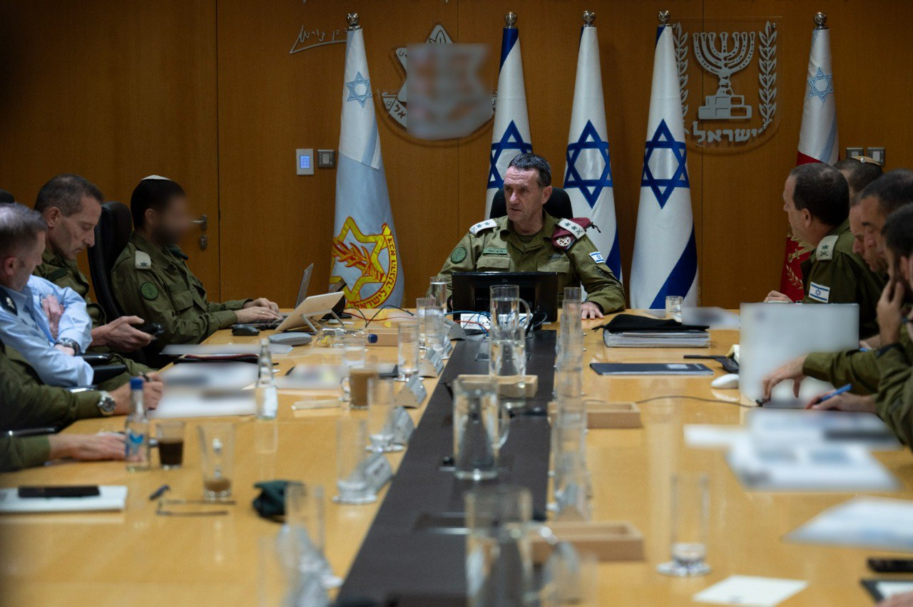

## Message 11057

דובר צה"ל:

הרמטכ״ל בתום הערכת מצב: ״נחושים לשנות את המציאות הביטחונית בצפון, כך שתושבי הצפון יוכלו לחזור לבתיהם בביטחון״

הרמטכ״ל, רב-אלוף הרצי הלוי, סיים כעת הערכת מצב בקריה עם חברי פורום המטה הכללי.

מדברי הרמטכ״ל: ״סיכלנו הבוקר מתקפת ירי רחבה של חיזבאללה לעבר עורף ישראל. אנחנו מאוד נחושים ונמשיך לעשות הכל להגן על אזרחי ישראל בכל מקום. 
אנחנו ממוקדים ברצועת עזה, לפרק את חמאס ולהשיב את החטופים. הלחץ שאנחנו מפעילים בהתקפות בעזה, הוא הלחץ שיביא להשבת החטופים. במקביל, אנחנו נלחמים נגד חיזבאללה בלבנון, ממשיכים ופוגעים בו באופן שיטתי. מתחילת המלחמה חיזבאללה איבד הרבה נכסים משמעותיים ומאות פעילים. אנחנו מאוד נחושים לשנות את המציאות הביטחונית בצפון, נמשיך לעשות כך ולפעול כדי להשיב את תושבי הצפון לבתיהם בביטחון״.

