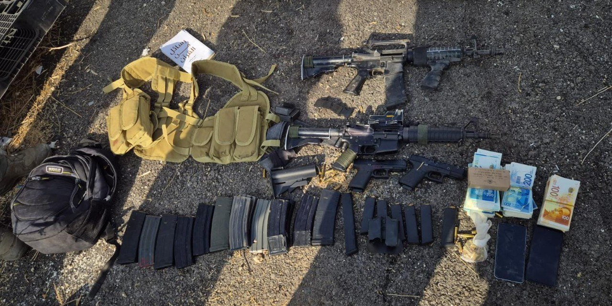

## Message 11153

הודעה משותפת לדובר צה״ל, דוברות המשטרה ודוברות שב״כ:

במסגרת המבצע בצפון השומרון, מסתערבי מג"ב איו"ש בהכוונת שב"כ חיסלו בחילופי ירי את ראש התארגנות הטרור של חמאס בג׳נין; כלי טיס של צה״ל תקף וחיסל שני מחבלים חמושים נוספים

במהלך המבצע של צה"ל, שב"כ ומג"ב בצפון השומרון, בשעות האחרונות זיהו הכוחות חוליית מחבלים ובראשה ראש התארגנות הטרור של חמאס בג׳נין ברכב במרחב ג'נין.

לאחר הזיהוי, מסתערבי מג"ב איו"ש פעלו בהכוונה מודיעינית של שב״כ, וחיסלו בחילופי אש את וסאם חאזם, ראש התארגנות הטרור של חמאס בג׳נין. חאזם היה מעורב בביצוע והכוונת פיגועי ירי ומטענים וקידום פעילויות טרור נוספות במרחב יהודה ושומרון.

זמן קצר לאחר מכן, כלי טיס של צה״ל חיסל שני מחבלים נוספים בזמן שניסו להימלט מהרכב שבו היו עם חאזם. המחבלים, מיסרה משארקה ועראפת עאמר, הינם פעילי טרור של חמאס בג׳נין אשר פעלו תחת וסאם חאזם והיו מעורבים בפיגועי ירי במרחב התפר לעבר ישובים ישראלים.
ברכבם של המחבלים ועל גופם אותרו רובים מסוג "M16", אקדח, מחסניות, מטענים, רימוני גז ועשרות אלפי שקלים של כספי טרור.
אין נפגעים לכוחותינו.

