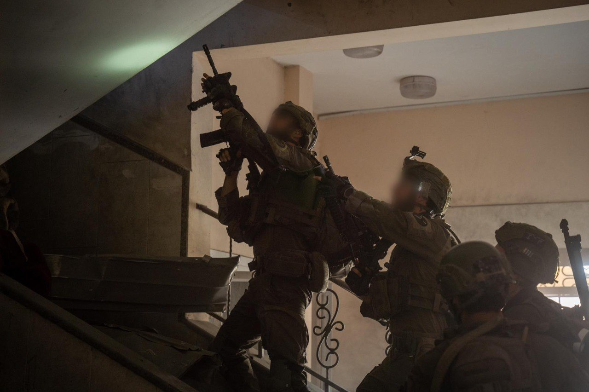

## Message 11155

דובר צה״ל:

השמדת 6 מנהרות שאורכן כ-6 קילומטרים, חיסול למעלה מ-250 מחבלים והשבת 6 גופות החטופים; כוחות אוגדה 98 השלימו את משימתם בדרום רצועת עזה ונערכים למשימות נוספות

כוחות אוגדה 98 השלימו את הפעילות האוגדתית במרחב חאן יונס ודיר אל באלח במקביל לאחר כחודש של תמרון בעל ובתת-קרקע. במסגרת הפעילות הכוחות חיסלו למעלה מ-250 מחבלים והשמידו עשרות תשתיות טרור.

יחידת יהל"ם וצוותי הקרב של חטיבה 7 והצנחנים איתרו והשמידו 6 מנהרות שאורכן מגיע לכ-6 קילומטרים של תוואי תת-קרקעי. בחלק מהמנהרות אותרו מתחמי שהייה של מחבלים, אמצעי לחימה ומחבלים שחוסלו.

צוות הקרב של חטיבה 7 נלחמו במרחב חאן יונס ובדיר אל באלח, איתרו אמצעי לחימה והשמידו עשרות מארבים ומתחמי לחימה.
כוחות גדוד 77 פשטו על מוצב מרכזי של ארגון הטרור חמאס במרחב דיר אל בלאח ואיתרו בו אמצעי לחימה, משגר רקטות ומסמכי מודיעין. בשיתוף יחידת יהל"ם אותר והושמד תוואי תת-קרקעי שהיווה חלק מרשת הלחימה של מחבלים במרחב המתחם.

צוות הקרב של חטיבת הצנחנים נלחמו בשכונת 'חמד' שבמערב חאן יונס ובשכונת המזרחיות של העיר. הכוחות, פעלו במרחב צפוף ובבניינים רבי קומות.

