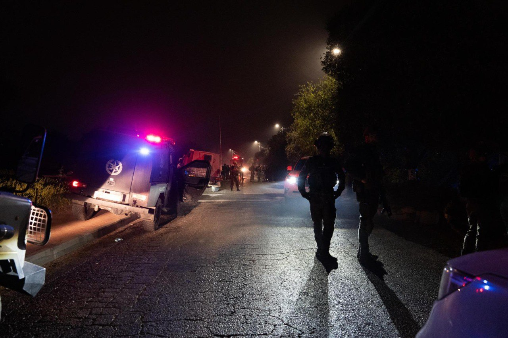

## Message 11176

דובר צה"ל:

כוחות ביטחון רבים ממשיכים בסריקות לשלילת חשד למחבלים נוספים ביישוב כרמי צור; מפקד פיקוד המרכז הגיע לזירת הפיגוע וקיים הערכת מצב ראשונית בשטח

בשעות האחרונות, כוחות ביטחון רבים ממשיכים לסרוק ביישוב כרמי צור על מנת לשלול חשד להימצאות מחבלים נוספים במקום.

מפקד פיקוד המרכז הגיע לכרמי צור וקיים הערכת מצב ראשונית בשטח יחד עם מפקד אוגדת איו"ש, מפקד חטיבת עציון, מפקד חטיבת יהודה ומפקדים נוספים.

מתחקור של אירוע פיצוץ הרכב בתחנת הדלק בצומת גוש עציון, עולה כי מדובר בנסיון פיגוע באמצעות מכונית תופת. בזמן שהלוחמים חיסלו את המחבל שניסה לתקוף אותם, כתוצאה מהירי לעבר המחבל, נפצע מפקד חטיבת עציון באורח קל והמשיך לפקד על חיסול המחבל, כמו כן נפצעו קצין לוחם נוסף באורח בינוני וקצין במילואים המשרת כרבש"ץ אחד היישובים הסמוכים במרחב באורח קל.

באירוע ביישוב כרמי צור, המחבל חדר ליישוב, סייר הביטחון פתח במרדף רכוב, התנגש ברכבו של המחבל ולאחר מכן פרק מהרכב וחיסל את המחבל. 
במהלך חילופי האש התפוצץ מטען שהיה ברכב המחבל.

