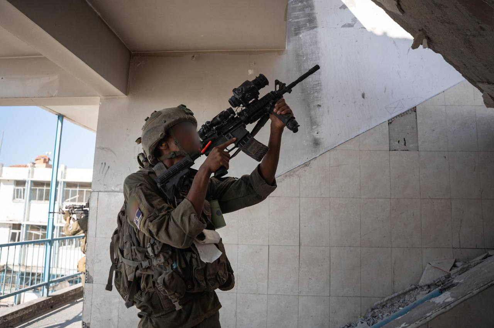

## Message 11185

דובר צה"ל:

אמצעי לחימה וציוד צבאי רב; כוחות אוגדה 162 ואוגדה 252 ממשיכים לפעול במקביל בדרום ומרכז הרצועה

כוחות אוגדה 252 ממשיכים לפעול במרחב העיר עזה.
במהלך היממה האחרונה הכוחות זיהו מחבל שמלכד מבנה סמוך לכוחות, בסגירת מעגל מהירה מטוס קרב של חיל האוויר השמיד את המבנה.
בנוסף, הכוחות חיסלו חוליות מחבלים, השמידו תשתיות טרור ומבנים צבאיים שהיוו איום על הכוח.

צוות הקרב של חטיבה 401 ממשיך לפעול במרחב רפיח תחת פיקוד אוגדה 162. במסגרת הפעילות הכוחות איתרו אמצעי לחימה רבים.
בנוסף, הכוחות חיסלו מספר חוליות מחבלים שהיוו איום על הכוח.

