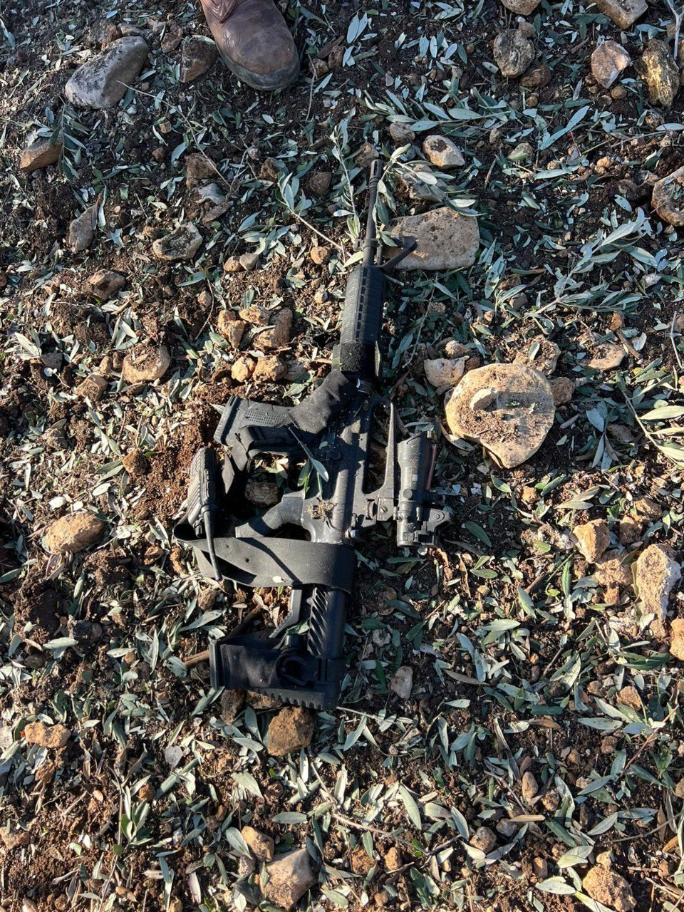

## Message 14228

הודעה משותפת לדובר צה"ל ודוברות שב"כ:

חוסל המחבל שרצח את יהונתן דויטש ז״ל ועמד בראש חוליית מחבלים שביצעה מספר פיגועי ירי במרחב הגלבוע, שלושה מחבלים נוספים חוסלו בתקיפה 

כלי טיס של חיל האוויר, בהכוונה מודיעינית ומבצעית של שב"כ, תקף וחיסל מוקדם יותר היום (א') חוליית מחבלים אשר ביצעה מספר פיגועי ירי לעבר יישובים במרחב הגלבוע.

ראש החוליה אשר חוסל בתקיפה, ואיל לחלוח, בן 31 תושב קבאטיה, ביצע את פיגוע הירי בצומת מחולה ב-11 באוגוסט 2024, בו נרצח יהונתן דויטש ז״ל ונפצע אזרח ישראלי נוסף. לאחר ביצוע הפיגוע ואיל המשיך לפעול בג׳נין לטובת גיוס פעילים והוצאה לפועל של פיגועים נוספים בטווח הזמן המיידי. 

מיד לאחר ביצוע התקיפה כוחות צה״ל מחטיבת מנשה פשטו על נקודת התקיפה, ואיתרו שלושה נשקים על גופות המחבלים. כמו כן, אותרו חלקי נשק נוספים, וסטים וחומרים להכנת מטענים.

כוחות הביטחון ימשיכו לפעול לסיכול איומי טרור ולשמירה על ביטחונם של אזרחי ישראל.

