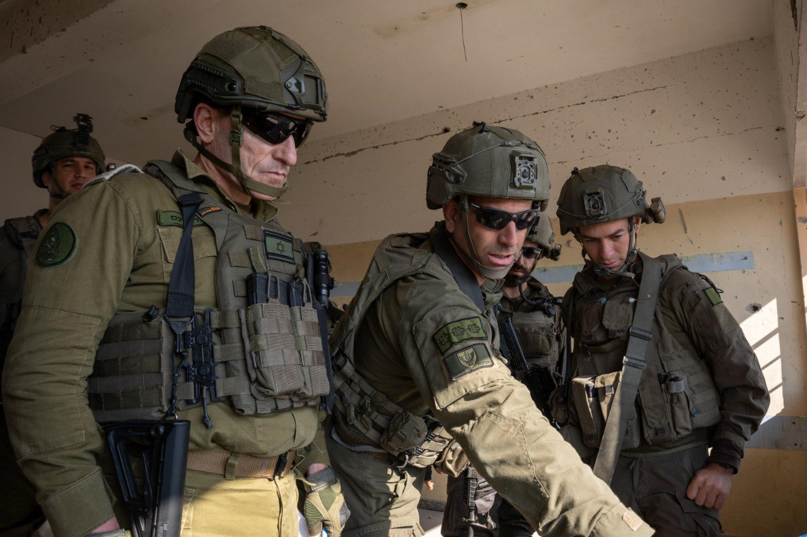

## Message 14241

דובר צה״ל:

סגן הרמטכ״ל ללוחמי צה״ל ברצועת עזה: ״צה״ל פועל בשבע חזיתות שונות, עשיית הלוחמים מרשימה, אך העומס ניכר ולכן חשובה הרחבת השורות״

סגן ראש המטה הכללי, אלוף אמיר ברעם, ביקר אתמול (א') בכלל האוגדות המתמרנות ברצועת עזה וקיים הערכת מצב גזרתית עם מפקדי הגדודים והחטיבות הפועלים תחת אוגדות 162, 99 ו-143.

סגן הרמטכ"ל סייר בשטח עם הכוחות וקיבל סקירה על הפעילות ההתקפית המאומצת הנעשית בג׳אבליה ורפיח.

