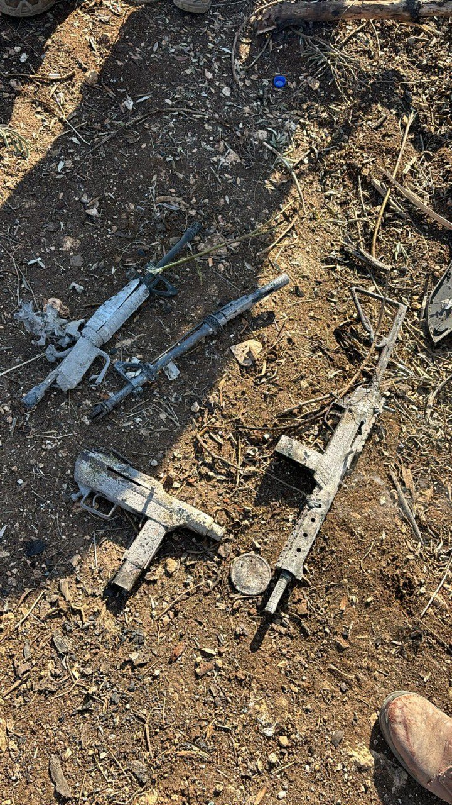

## Message 14272

הודעה משותפת לדובר צה"ל ודוברות שב"כ:

צה"ל ושב"כ חיסלו מחבלים שתכננו לבצע פיגוע טרור בטווח זמן המיידי

כלי טיס של חיל האוויר תקף הבוקר (ג'), בהכוונה מודיעינית של שב״כ, כלי רכב במרחב בצפון השומרון. בתקיפה נהרגו שלושה מחבלים מארגון הטרור חמאס שתכננו לבצע פיגוע טרור בטווח זמן המיידי.
לאחר התקיפה, כוחות צה"ל מחטיבת הבקעה והעמקים, חטיבת כפיר ודובדבן, פשטו על נקודת התקיפה, בה אותרו ארבעה כלי נשק מסוגים שונים.

