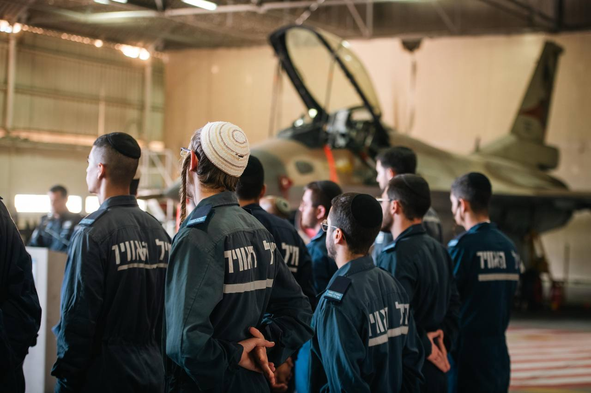

## Message 14276

דובר צה"ל:

דת”ק חרדי ראשון הוקם בחיל האוויר

טקס סיום קורס טכנאי דרג א' לחיילים מהמגזר החרדי התקיים אתמול (ג') בבסיס הטכני בחיפה. 
בקורס הוסמכו החיילים לרמת טכנאי דרג א' על מטוסי ה-F-16. הטכנאים ישרתו בדת”ק (דיר תת-קרקעי) המשמש מרכז תפעולי של מטוסי קרב בחיל האוויר.

הדת”ק ממוקם בטייסת "העקרב" (105) בבסיס "רמת דוד", והקמתו התאפשרה הודות לשיתוף פעולה הדוק עם אגף כוח האדם ועמותת "צורים", ולהתאמות ייחודיות בסביבת ההכשרה והעבודה.

26 הטכנאים שהוכשרו יבטיחו את הכשירות המבצעית של המטוסים ושל מערכות הנשק. 
זהו קורס ההכשרה הראשון לטכנאי דרג א' מהמגזר החרדי והוא חלק מתהליכים משמעותיים בצה"ל אשר נועדו לשלב צעירים חרדים בצבא, תוך ביצוע ההתאמות הנדרשות לשמירה על אורח חיים דתי, כגון לינה נפרדת, כשרות למהדרין והקמת בית כנסת בדת"ק.

