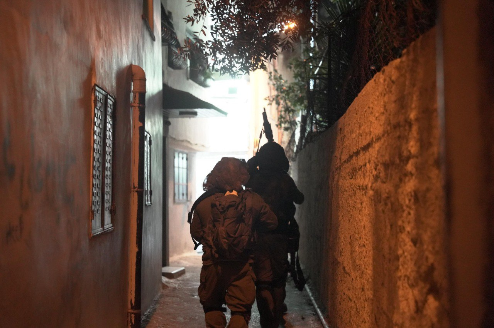

## Message 14291

דובר צה"ל:

שבעה מחבלים חוסלו מהאוויר, כ-50 מבוקשים נעצרו וכ-15 נשקים הוחרמו: פעילות כוחות הביטחון ברחבי יהודה ושומרון בשבוע האחרון 

כוחות צה״ל, שב״כ ומג״ב פעלו במהלך השבוע למעצר של כ-50 מבוקשים ברחבי פיקוד המרכז והחרימו כ-15 נשקים, אלפי שקלים בכספי טרור, חלקי נשק וציוד צבאי נוסף. בנוסף, חוסלו השבוע שבעה מחבלים ברחבי הפיקוד באמצעות כלי טיס של חיל האוויר.

במהלך הלילה כוחות חטיבת שומרון ודובדבן פעלו בשכם, בבית פוריק ובמספר כפרים נוספים במרחב. הכוחות עצרו שבעה מבוקשים, השמידו מטענים ואיתרו שלושה כלי נשק מסוג 'קרלו', שני אקדחים ותחמושת. כמו כן, במספר כפרים בחטיבת יהודה נעצרו שני מבוקשים והוחרמו חלקי נשק וכספי טרור.

בנוסף, הכוחות פעלו בחטיבת בנימין ועצרו שלושה מבוקשים, בחטיבת עציון נעצרו שני מבוקשים והוחרם ציוד צבאי.
אין נפגעים לכוחותינו.

