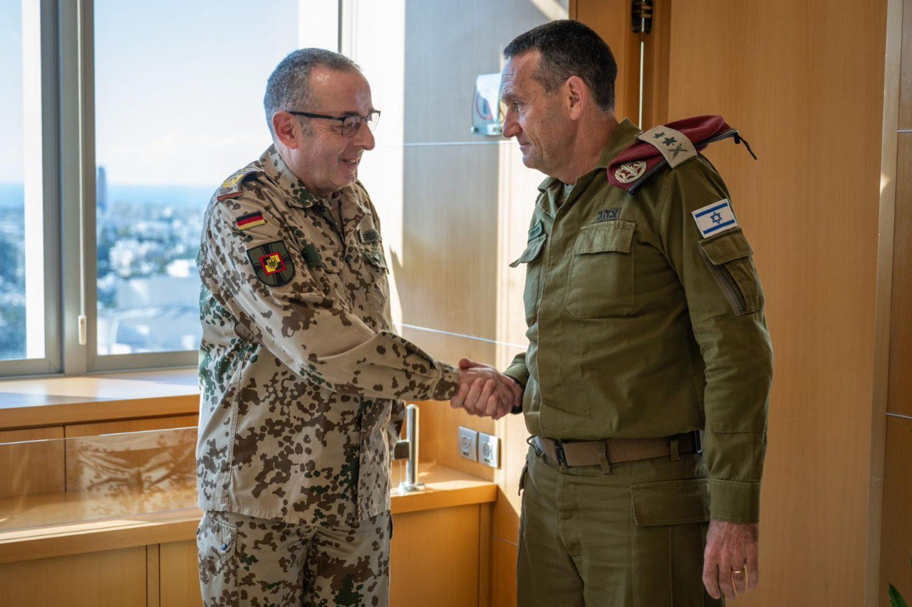

## Message 14307

דובר צה"ל:

הרמטכ"ל, רב-אלוף הרצי הלוי, אירח אתמול (ה') את רמטכ״ל גרמניה, הגנרל (****) קרסטן ברוייר כאורחו הרשמי. 

השניים שוחחו על האירועים המבצעיים האחרונים בדגש על הזירה הצפונית, שיתוף הפעולה ההולך ומתחזק בין הצבאות והמוכנות לאיומים קרובים ורחוקים. 

הרמטכ״ל הביע את הערכתו לרמטכ״ל גרמניה על המחויבות המשותפת לחיזוק היציבות האזורית והביטחון במזרח התיכון.

