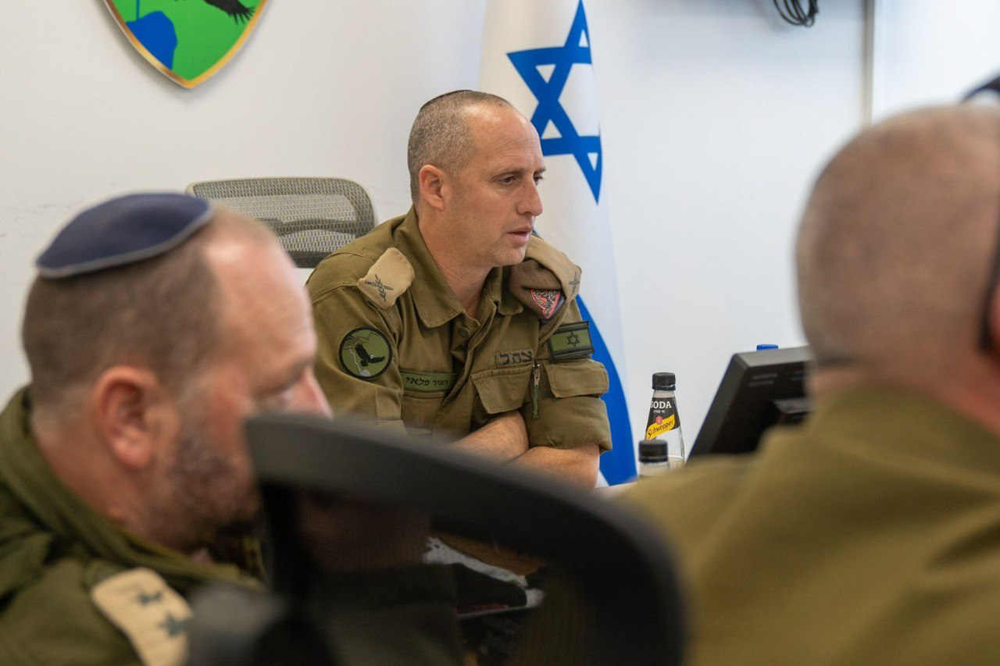

## Message 14312

דובר צה"ל:

לאור הערכת מצב שמתקיימת מאתמול במטכ״ל ובפיקוד הצפון, ולאור ההתפתחויות בלחימה הפנימית בסוריה, הוחלט על תגבור כוחות אוויריים וקרקעיים בגזרת רמת הגולן.

כוחות צה״ל פרוסים במרחב הגבול ומעלים כשירות ומוכנות בהתאם לתרחישים השונים.

צה״ל עוקב אחרי האירועים ונערך לכל תרחיש בהתקפה ובהגנה, לא יאפשר איום סמוך לגבול ישראל, ויפעל לסכל כל איום על אזרחי מדינת ישראל.

