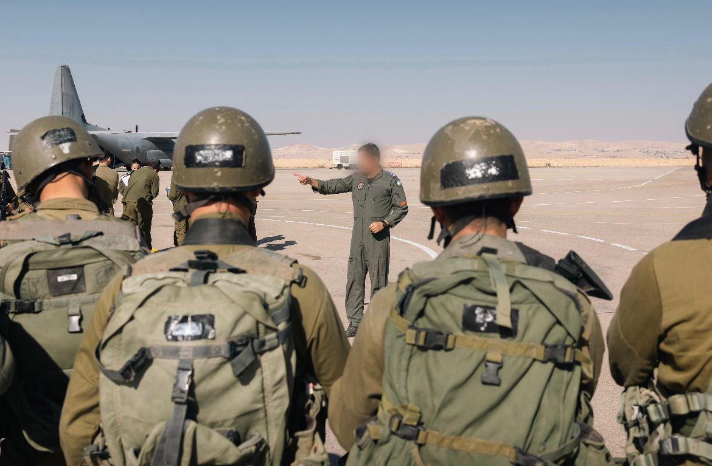

## Message 14327

דובר צה״ל:

במהלך סוף השבוע: הושלם תרגיל בהובלת אגף המבצעים המדמה הפעלת כוחות כוננות מטכ״ליים בזמן אמת

על רקע האירועים בגבול סוריה, הושלם אתמול (ו׳) תרגיל מטכ״לי - ׳יובל שיא׳ בצפון בקעת הירדן ובדרום רמת הגולן, במסגרתו תרגל אגף המבצעים הקפצת כוחות כוננות מטכ״ליים, באוויר וביבשה, ובחן את זמן ואופן התגובה שלהם לאירוע מתפרץ בזמן אמת. 

התרגיל נועד לדייק את התיאום בין כוחות היבשה לכוחות האוויריים, ובכך לטייב את קצב ואיכות המענה המהיר לתרחישים השונים בזמן אירוע מתפרץ. 

בתרגיל השתתפו לוחמים מההכשרות והטייסות השונות, אשר חלקם נשארו במרחב רמת הגולן על מנת לתגבר במשימות אמת בהגנה בגבול סוריה.

