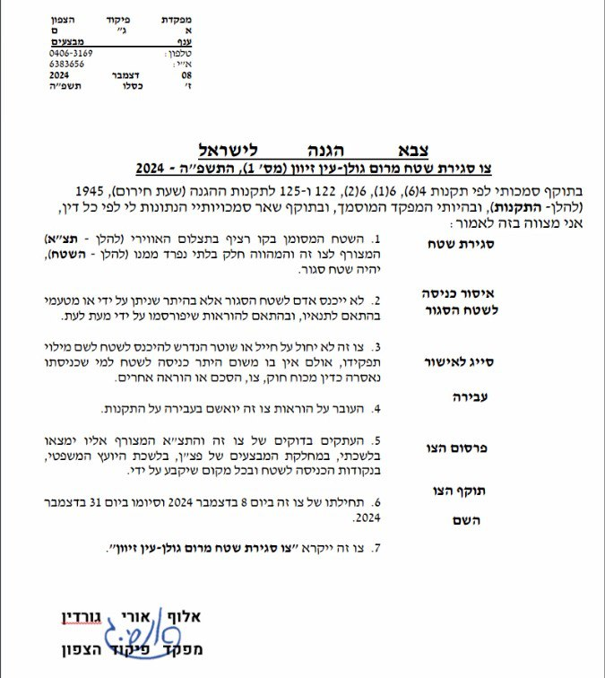

## Message 14346

דובר צה"ל:

בהתאם להערכת המצב בפיקוד הצפון, הוחלט כי בארבע רשויות דרוזיות בצפון רמת הגולן (בוקעתא, עין קניה, מסעדה ומגדל שמס) הלימודים בבתי הספר יתקיימו באופן מקוון ובגני הילדים יתקיימו ללא שינוי.
ביתר מרחב רמת הגולן הלימודים יתקיימו כסדרם.

כמו כן, בהתאם להערכת המצב, הוחלט על צו שטח צבאי סגור מהיום (א׳), בשטחים חקלאיים במרחבים מרום גולן-עין זיוון ובוקעתא-חרבת עין חורה. 

תוגבל כניסת חקלאים לשטחים ספציפיים בהתאם לצרכי הצבא וזאת למשך מספר שעות ובתיאום מלא מול חטמ״ר 474. 
צה"ל מבהיר כי הכניסה למרחבים אלו אסורה בהחלט.

