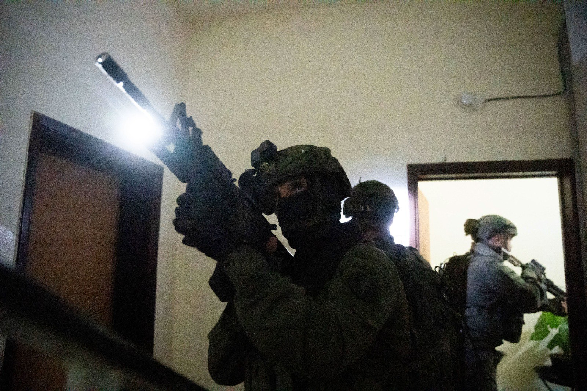

## Message 14372

דובר צה"ל:

כוחות הביטחון פעלו הלילה בבית המחבל שביצע את הפיגוע בצומת אל פאוור: כעשרה מבוקשים נעצרו ברחבי יהודה ושומרון

כוחות צה"ל, שב"כ ומג"ב פעלו במהלך הלילה לסיכול פעילויות טרור ועצרו כעשרה מבוקשים במספר מרחבים ביהודה ושומרון.

הכוחות פעלו בדורא שבחטיבת יהודה בביתו של המחבל שביצע את פיגוע הדריסה בצומת אל פאוור בשבת, ותחקרו חשודים בסיוע למחבל. בנוסף, התקיים מבצע גדודי בסילוואד שבחטיבת בנימין בו הכוחות החרימו שני אקדחים וחומרי הסתה של ארגון הטרור חמאס, תחקרו עשרות חשודים בפעילות טרור ועצרו מבוקש. 

כמו כן, ביעבד שבחטיבת מנשה תוחקרו עשרות חשודים בפעילות טרור, ונעצרו שני מבוקשים. במספר כפרים בחטיבת אפרים, בדהיישה שבחטיבת עציון ובסמוע שבחטיבת יהודה נעצרו שמונה מבוקשים נוספים, אין נפגעים לכוחותינו.

