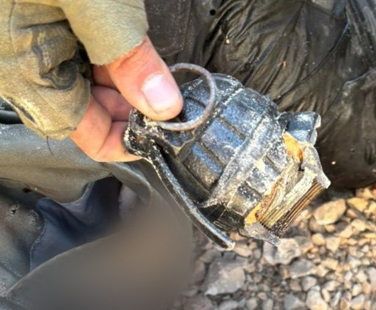

## Message 14379

דובר צה"ל:

חוסלו באמצעות תקיפה מהאוויר שני חמושים במהלך פעילות צה״ל בחטיבת הבקעה והעמקים

במהלך פעילות של לוחמי יחידת דובדבן למעצר מבוקש ולסיכול תשתיות טרור בטובאס שבחטיבת הבקעה והעמקים, זוהו מספר חמושים במרחב. כלי טיס של חיל האוויר תקף את החמושים וחיסל אותם. 
לוחמי חטיבת כפיר פשטו על נקודת התקיפה והחרימו נשק מסוג M-16, שני אקדחים ורימון רסס שהיו על החמושים. 

כוחות צה"ל ממשיכים לפעול בעוצמה לסיכול הטרור במרחב.

