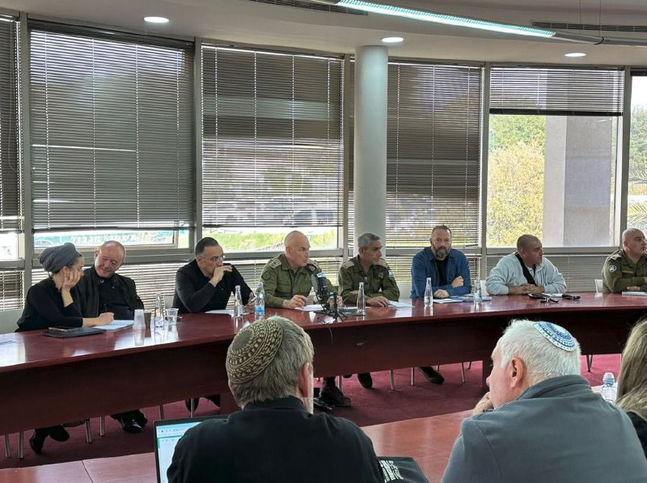

## Message 14400

דובר צה"ל:

מפקד פיקוד הצפון, אלוף אורי גורדין, קיים אתמול (ג׳) סיור במספר רשויות בגליל עם ראש מנהלת הישום בצפון, ראשי הרשויות, גורמים במועצות המקומיות ומפקדים נוספים. במהלך הביקור סקר האלוף למשתתפים את הפעולות הנעשות בהגנה ובהתקפה והדגיש את חשיבות שיתוף הפעולה ההדוק לאורך הדרך.

