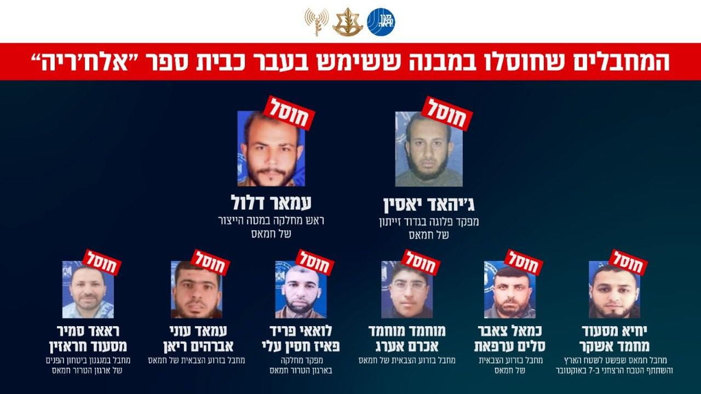

## Message 14418

הודעה משותפת לדובר צה"ל ודוברות שב"כ:

צה"ל ושב"כ חיסלו ראש מחלקה במטה הייצור של ארגון הטרור חמאס ומפקד פלוגה בגדוד זייתון, לצד מספר מחבלים נוספים

במהלך שבוע שעבר כלי טיס של חיל האוויר תקפו באופן ממוקד ובהכוונה מודיעינית של אמ"ן, שב"כ ופיקוד הדרום, וחיסלו ראש מחלקה במטה הייצור של ארגון הטרור חמאס ומפקד פלוגה בגדוד זייתון של חמאס, אשר פעלו במתחם פיקוד ושליטה ששימש בעבר כבית ספר "אלח׳ריה" בעיר עזה.

המחבל עמאר דלול שימש כראש מחלקה במטה הייצור של ארגון הטרור חמאס והיווה מוקד ידע משמעותי בארגון הטרור. 

המחבל ג'יהאד יאסין, מפקד פלוגה בגדוד זייתון של חמאס, עסק בפעילות התקפית נגד כוחות צה״ל המתמרנים בשטח.
גדוד זייתון אחראי על מתווי טרור רבים שבוצעו לאחרונה נגד כוחות צה״ל הפועלים בשטח הרצועה.

בתקיפה זו חוסלו שישה מחבלי חמאס נוספים, בהם מחבל אשר פשט לשטח הארץ בטבח הרצחני ב-7 באוקטובר:

