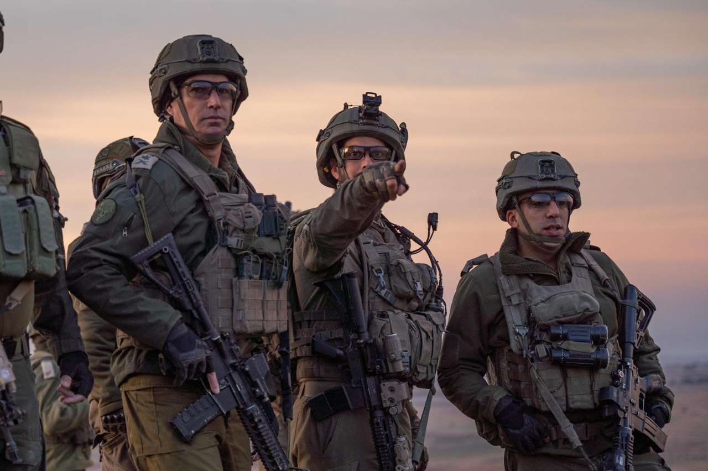

## Message 14420

דובר צה״ל:

מפקד פיקוד הצפון ביקר את כוחות צק״ח 474 בשטח סוריה בעת משימתם בהגנה קדמית במרחב

מפקד פיקוד הצפון, אלוף אורי גורדין, קיים אתמול (ד׳) הערכת מצב וסיור אצל הכוחות הנמצאים בהגנה קדמית במרחב החיץ עם מפקד אוגדה 210, תת-אלוף יאיר פלאי, מפקד חטיבה 474, אלוף-משנה בני קטה ומפקד גדוד 101, סגן-אלוף מיכה דהן. 

המפקדים הביעו הערכה רבה לכוחות על פעילותם, והדגישו את חשיבותם בפעילות היזומה להגנה בשטח ונכונותם לפעול אל מול כל איום על תושבי מדינת ישראל ורמת הגולן בפרט.

