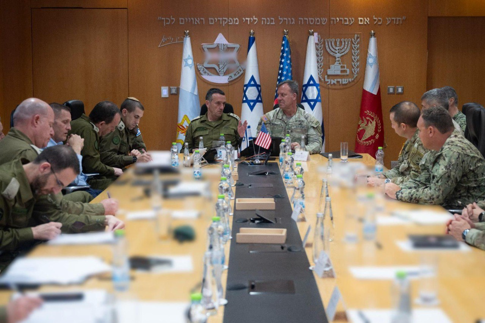

## Message 14445

דובר צה״ל: 

מפקד פיקוד המרכז בצבא ארה"ב (CENTCOM), גנרל (****) מייקל אריק קורילה נחת השבוע (ד׳) בישראל כאורחו הרשמי של ראש המטה הכללי, רב-אלוף הרצי הלוי. 

הרמטכ״ל ומפקד סנטקום קיימו אתמול (ו׳) הערכת מצב משותפת בנושאים ביטחוניים-אסטרטגיים כחלק מהמענה לאיומים במזרח התיכון, בדגש על הזירה הצפונית ואיראן. 

השניים שוחחו על האירועים המבצעיים האחרונים ותרחישים אפשריים בזירה הצפונית, במטרה להבטיח מוכנות משותפת לכל התפתחות. 

הפגישה מהווה חיזוק נוסף לקשר האסטרטגי ההדוק בין צה”ל לצבא ארצות הברית, קשר שמוביל ליתרון מבצעי במזרח התיכון מתוך מחויבות לחיזוק היציבות האזורית.

