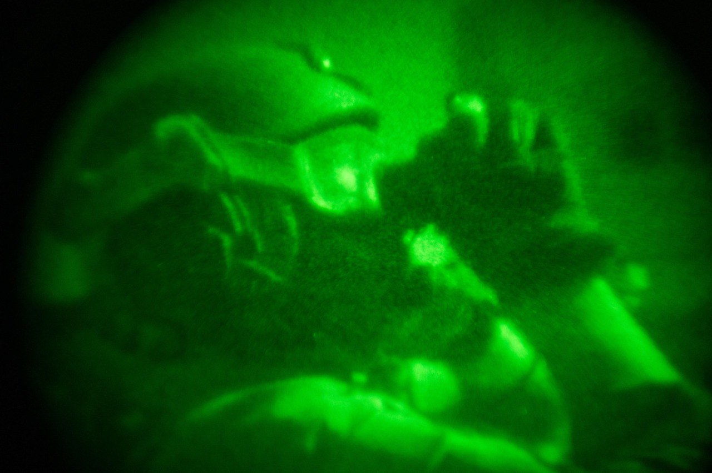

## Message 14451

דובר צה"ל:

במהלך פעילות של כוחות צוות הקרב של חטיבת גבעתי, בפיקוד אוגדה 162 ובשיתוף שב"כ, פשטו הלוחמים על נקודת ריכוז מחבלים במרחב בית-חאנון, זאת בעקבות מידע מודיעיני מקדים על הימצאות מחבלים במרחב. 
בשיתוף עם כוחות חיל האוויר חוסלו בסגירות מעגל מהאוויר ומהקרקע עשרות מחבלים ונעצרו מחבלים נוספים.

בפעילות של צוות הקרב של חטיבת כפיר במרחב בית לאהיה, חיסלו הכוחות מחבלים מהאוויר ומהקרקע, איתרו והשמידו אמצעי לחימה רבים, ביניהם נשקים, מטענים ועשרות רימוני רסס. 

בנוסף, מטוסי קרב של חיל האוויר, תקפו מוקדם יותר היום (א'), באופן ממוקד ובהכוונה מודיעינית של אמ"ן, שב"כ ופיקוד הדרום, מחבלים שפעלו במתחם פיקוד ושליטה במרחב ששימש בעבר כמרפאת "אבו-שבאכ" שבצפון רצועת עזה. 
המתחם שימש את מחבלי החמאס לתכנון ולהוצאה לפועל של פעולות טרור נגד כוחות צה"ל ומדינת ישראל, ואוחסנו בו אמצעי לחימה רבים ששימשו את מחבלי החמאס.

