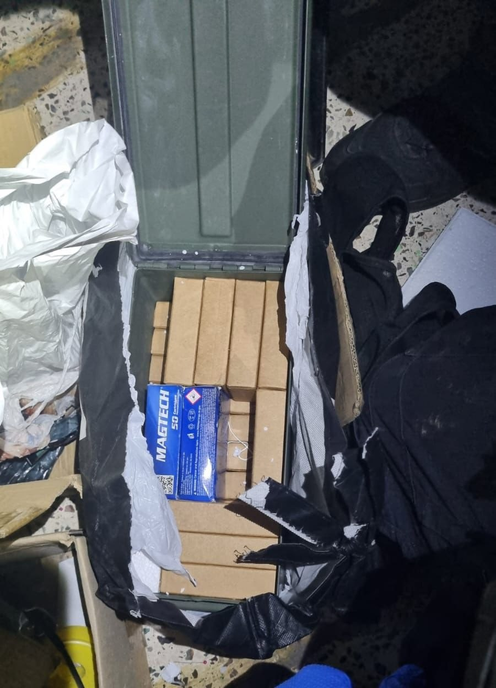

## Message 14521

דובר צה"ל:

כוחות הביטחון החרימו הלילה חמישה כלי נשק ותחמושת רבה ברחבי פיקוד המרכז: כעשרה כלי נשק נתפסו השבוע כחלק מהמערכה באמצעי הלחימה בגזרה

כוחות צה״ל, שב״כ ומג״ב פעלו במהלך הלילה לסיכול טרור והחרמת אמצעי לחימה במספר מרחבים ביהודה ושומרון. 

כחלק מהמערכה באמצעי לחימה בפיקוד המרכז, כוחות הביטחון החרימו במהלך הלילה חמישה נשקים ותחמושת רבה בסמוע שבחטיבת יהודה ובחלחול שבחטיבת עציון.
כמו כן, הכוחות עצרו ארבעה מבוקשים בחלחול, בדיר רזאללה שבחטיבת מנשה ובסילת שבחטיבת שומרון. 
 
כוחות צה״ל החרימו במהלך השבוע עשרות כלי רכב בלתי חוקיים ברחבי יהודה ושומרון, יותר ממיליון ש״ח כספי טרור וכעשרה כלי נשק. 

המבוקשים שנעצרו ואמצעי הלחימה שהוחרמו הועברו להמשך טיפול כוחות הביטחון, אין נפגעים לכוחותינו.

