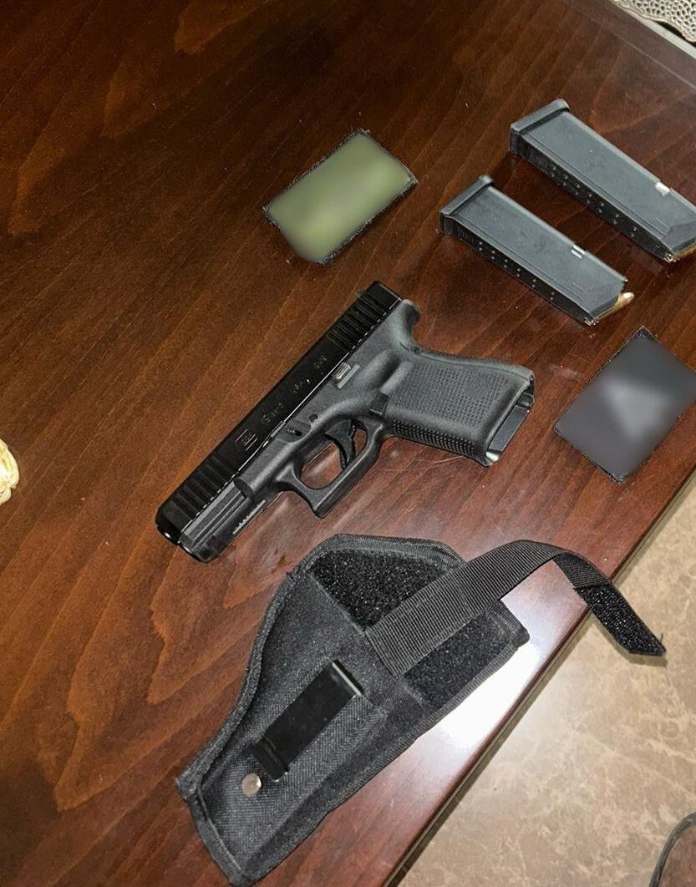

## Message 14547

כוחות צה"ל, שב"כ, משטרת ישראל ומג"ב פעלו במהלך הלילה לסיכול טרור במספר מרחבים בפיקוד המרכז. 

כחלק מפעילות מתמשכת להחרמת אמצעי לחימה בפיקוד המרכז, הכוחות איתרו והחרימו במהלך הלילה בטולכרם שבמנשה, בתל שבשומרון ובסמוע שביהודה חמישה כלי נשק, מחסניות וציוד צבאי נוסף.

הכוחות עצרו שבעה מבוקשים בעציון, במנשה, בשומרון ובחטיבת הבקעה והעמקים ותחקרו עשרות חשודים במעורבות בפעילויות טרור. אין נפגעים לכוחותינו.

