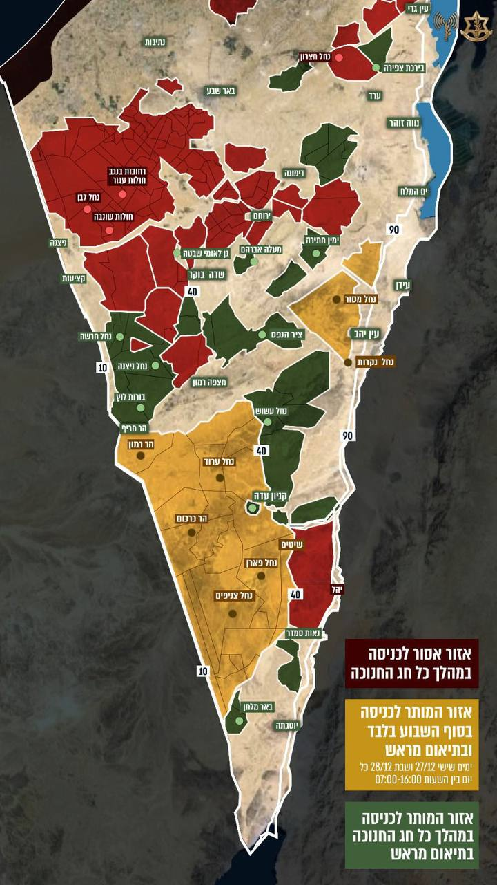

## Message 14550

דובר צה״ל:

בשל המצב המבצעי ובהתאם להערכת המצב, במהלך חג חנוכה תתאפשר כניסת מטיילים לחלק משטחי האימונים (שטחי אש) בדרום הארץ באופן מוגבל.

נזכיר כי כחלק מהערכת המצב, הוחלט כי השנה צה״ל לא יפתח את ציר 10 למטיילים בתקופה זו.

צה"ל מבקש מהציבור לא להיכנס למרחבים האסורים, ולאפשר לכוחות הביטחון להמשיך ולבצע את משימותיהם. 
בשטחי האש מתקיימים אימונים כל העת - כל הגעה לשטח צבאי מצריכה תיאום ואישור מראש. 
הגעה לשטח צבאי ללא תיאום ואישור מראש מסכנת את ביטחון המטיילים. 

כניסת מטיילים לשטחים המותרים תתאפשר בתיאום של שלושה ימים מראש. 

מטיילים שנתקלים בנפל, תחמושת או בחפץ חשוד מתבקשים להתרחק ממנו ולדווח לפיקוד הדרום באופן מיידי במספר הטלפון המצורף.

להלן, מספרי הטלפון לתיאום ובירור טיולים בדרום הארץ: 
08-9902926/8 / 0529010563 (סמס בלבד)

