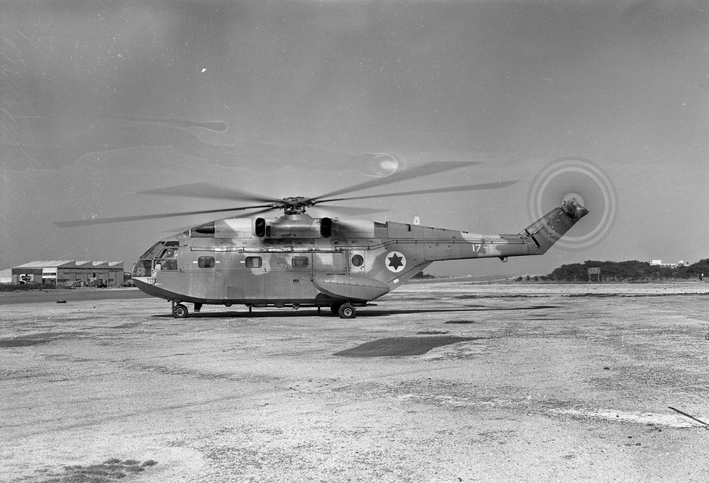

## Message 14557

דובר צה"ל:

סגירת מעגל: נמצא חלקו של מסוק חיל האוויר שהתרסק בסוריה לפני חמישים שנה

במסגרת פעילות הגנה שגרתית של כוחות שלדג וחטיבת "ההרים" במרחב סוריה, אותר והושב ראש הרוטור של מסוק "הצרעה" מספר 17 השייך לטייסת 114 (טייסת "הסופר פרלון" לשעבר). חלק זה נשאר במרחב לאחר התרסקות המסוק ב-27 לאפריל 1974, אשר הוזנק לחלץ לוחמי צנחנים שנפצעו ונפגעו במהלך היתקלות. 

טייסי המסוק, רב-סרן גולן לוי וסגן אמיר אמית ז״ל, המכונאים המוטסים, סמל-ראשון יעקב ברנהיים וסמל-ראשון יעקב רול ז״ל, רופא יחידה 669, רב-סרן ד"ר אחיקם אבני פיינשטיין ז״ל וחובש יחידה 669, סמל מאיר רוזנשטרוך ז״ל - נספו בתאונה. לאחר התאונה, החללים הובאו לקבורה בארץ ישראל.

יחידה 669, בשיתוף יחידת אית"ן בחיל האוויר, הגיעו אל ההר על מנת להשיב את ראש הרוטור לטובת הנצחה ומסורת, וכן סרקו את השטח לוודא שאין חפצים אישיים או בעלי משמעות עבור המשפחות השכולות שנותרו במרחב. צה"ל משתתף בצערן של משפחות החללים וממשיך ללוותן.

