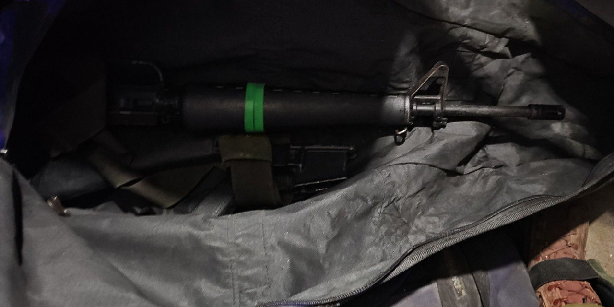

## Message 14561

דובר צה"ל:

לוחמי צה"ל, שב"כ וכוחות משטרת ישראל פעלו במהלך הלילה ברחבי אוגדת יהודה ושומרון ועצרו תשעה מבוקשים. בבית לחם שבחטיבת עציון איתרו הכוחות רובה מסוג M16, תחמושת, חלקי נשק וציוד צבאי נוסף. בתקוע שבגזרת החטיבה נעצרו שלושה מבוקשים ותוחקרו עשרות חשודים בפעילות טרור.

ביטא שבחטיבת יהודה אותר רובה מסוג "קרלו", בתרקומיא שבחטיבת יהודה נעצרו ארבעה מבוקשים נוספים, ובאל פאוור שבגזרת החטיבה תוחקרו חשודים רבים.
בכפר קליל שבחטיבת שומרון איתרו הכוחות חלקי נשק, תחמושת וחלקי מטענים. בקלקיליה שבאפרים נעצרו שני מבוקשים נוספים.

המבוקשים שנעצרו ואמצעי הלחימה שהוחרמו הועברו להמשך טיפול כוחות הביטחון, אין נפגעים לכוחותינו.

