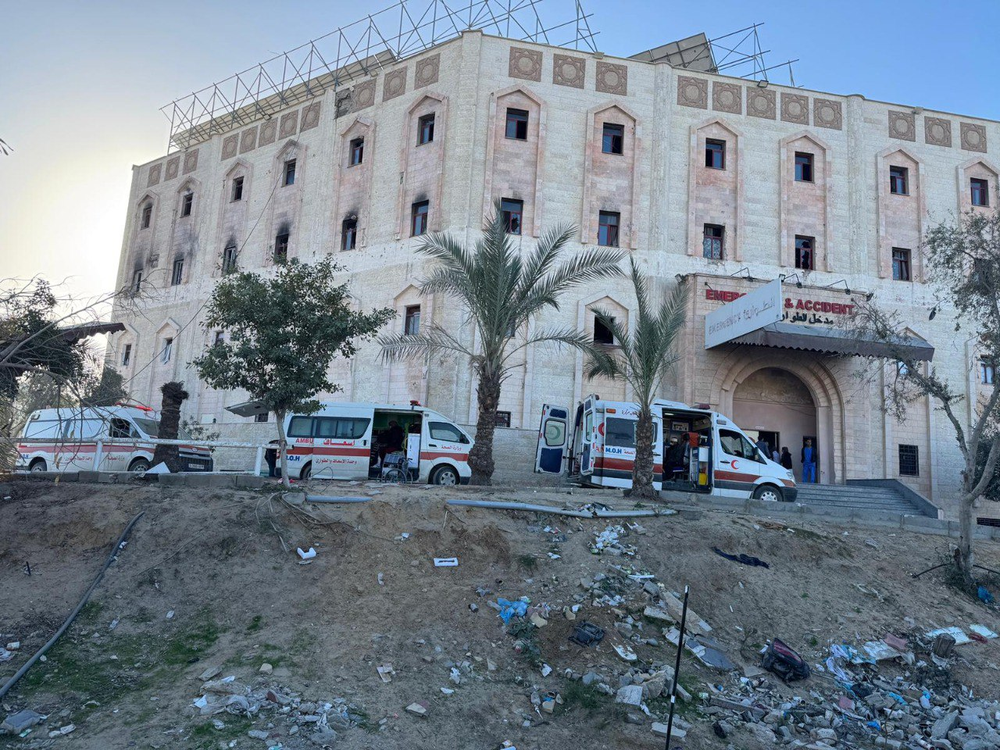

## Message 14580

הודעה משותפת לדובר צה"ל ודוברות שב"כ:

צה"ל ושב״כ סיימו פעילות ממוקדת לסיכול טרור באופן מדויק במרחב בית החולים האינדונזי

כוחות צוות הקרב של חטיבת גבעתי בפיקוד אוגדה 162, פעלו משעות הלילה בעקבות מידע מודיעיני מקדים של אמ״ן ושב״כ על המצאות מחבלים ותשתיות טרור במרחב בית החולים האינדונזי שבג׳באליה.

בחודש האחרון יצאו לפועל מתווי טרור,  בהם ירי נ״ט לעבר כוחותינו ממרחב בית החולים.
בנוסף, הכוחות פועלים במרחב הסובב את בית החולים בו הוטמנו מטענים ומלכודים רבים על ידי מחבלים. 

הכוחות חיסלו חמישה מחבלים ועצרו מספר מחבלים בבית החולים ובסביבתו,  בהם מחבל שפשט לשטח הארץ בטבח הרצחני ב-7 באוקטובר 2023.

