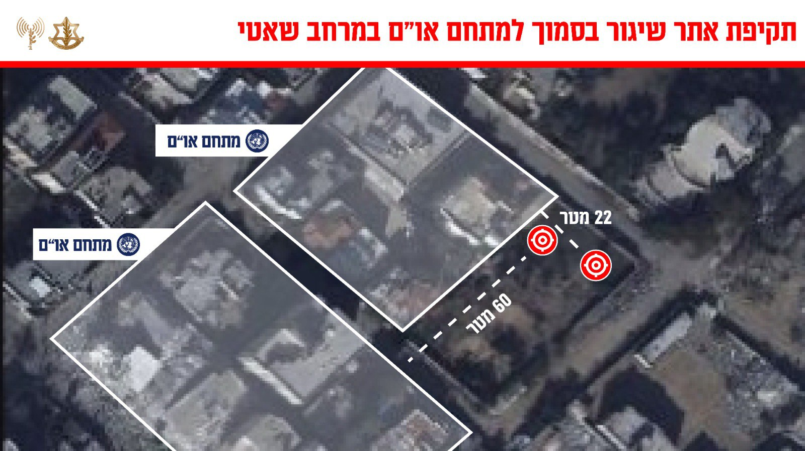

## Message 14590

דובר צה"ל:

צה"ל תקף אתר שיגור של חמאס הממוקם בסמוך למבנה של האו״ם בשאטי

מטוסי קרב של חיל האוויר תקפו לפני זמן קצר אתר שיגור של ארגון הטרור חמאס שמוקם בסמוך למבנה של האו״ם במרחב שאטי שבצפון הרצועה.

התקיפה בוצעה לאחר פרסום הודעה הקוראת לפינוי אוכלוסיה ממרחב המטרה לשם הגנתה, לאחר התקיפה זוהתה רקטה היוצאת ממתחם השיגור.

ארגון הטרור חמאס מפר באופן שיטתי את הדין הבין לאומי, תוך ניצול אכזרי של מחסות פעילים, מבנים אזרחיים ומבני או״ם ומשתמש באוכלוסייה האזרחית כמגן אנושי לפעולת טרור.

צה״ל ימשיך לפעול בעוצמה ובנחישות כנגד כל ארגוני הטרור.

