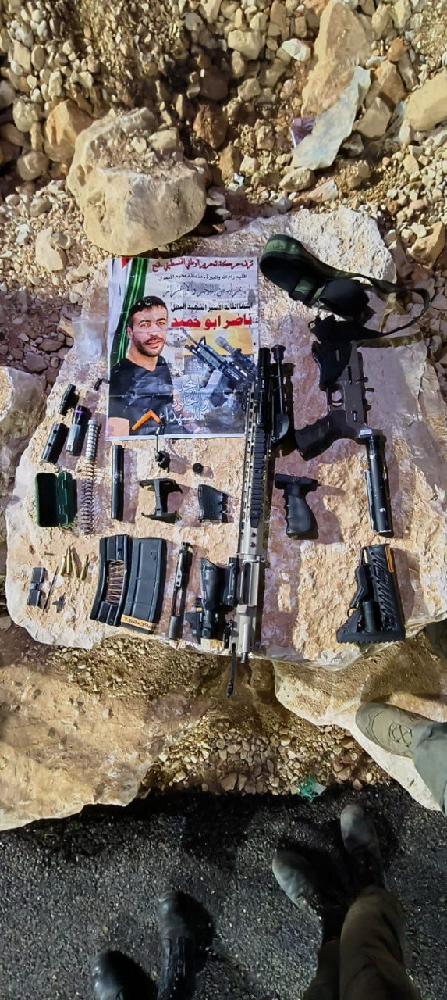

## Message 14614

הודעה משותפת לדובר צה"ל ודוברות המשטרה:

סגירות מעגל מהאוויר וחילופי אש מהקרקע: כוחות הביטחון ממשיכים בפעילות העצימה ברחבי פיקוד המרכז

כוחות מסתערבי מג״ב איו״ש וצה"ל פעלו בהכוונת שב"כ במהלך היום במרחב שכם שבחטיבת שומרון. במהלך הפעילות הכוחות פתחו בנוהל "סיר לחץ" על מבנה תוך חילופי אש עם מחבלים שהתבצרו בתוכו. 
בתום חילופי האש המחבלים הסגירו את עצמם עם שני נשקים מסוג M-16 ונלקחו להמשך חקירת כוחות הביטחון. הכוחות פשטו על האיתור בתום הפעולה ואיתרו ערכה להפעלת מטענים, מחסניות וציוד צבאי. הלוחמים ירו ופגעו במחבל חמוש נוסף.

לוחמי צה״ל, שב״כ ומסתערבי מג״ב ירושלים פעלו בשעות הלילה והבוקר במבצע במרחב בחטיבת בנימין, עצרו שלושה מבוקשים והחרימו אמצעי לחימה. במהלך הפעילות, הכוחות ירו בחשוד שהתקרב לעבר הכוחות והיווה איום עליהם. 
בזמן הפינוי של החשוד לקבלת טיפול רפואי, התברר כי מדובר באזרח ישראלי ולכן הועבר לקבלת טיפול רפואי בישראל.

כמו כן, במהלך פעילות כוחות הביטחון במרחב חטיבת הבקעה והעמקים במהלך הלילה, כלי טיס של חיל האוויר תקף חוליית מחבלים שהטמינה מטענים במרחב. מחבל נוסף חוסל.

