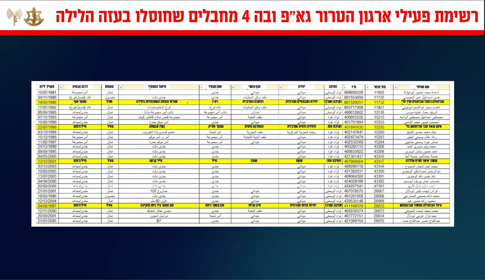

## Message 14630

הודעה משותפת לדובר צה"ל ודוברות שב"כ:

כלי טיס של חיל האוויר תקף במהלך הלילה, באופן ממוקד ובהכוונה מודיענית של אמ״ן, שב"כ ופיקוד הדרום, רכב ובו חוליית מחבלים מארגון הטרור הג׳יאהד האיסלאמי הפלסטיני במרחב נוציראת.

בתקיפה חוסלו מספר מחבלים מארגון הטרור גא"פ, בהם:

1. המחבל אבראהים גמאל אבראהים שיך עלי, מחבל בתחום המבצעים וההסברה הקרבית בארגון הטרור גא"פ.

2. המחבל פיצל עבדאללה מוחמד אבו קמצאן, אחראי ביטחון במרחב נוציראת בארגון הטרור גא"פ.

3. המחבל מחמד איאד חמיס לדעה, מחבל בתחום ההסברה הקרבית בארגון הטרור גא"פ.

4. המחבל אימן נהאד עבד אלרחמאן גדי, מחבל בתחום ההסברה הקרבית בארגון הטרור גא"פ, בעברו בכוח הימי של הארגון.

5. מחבל פאדי איהאב מחמד רמדאן חסונה, מחבל בתחום ההסברה הקרבית במרחב נוציראת בארגון הטרור גא"פ. 

המידע על בסיסו ניתן לקבוע כי מדובר בפעילי גא"פ שפעלו במסווה של עיתונאים, מגיע ממגוון מקורות מודיעיניים, ביניהם רשימת פעילי גא"פ אשר נתפסה על ידי כוחות צה"ל במהלך פעילות הכוחות ברצועת עזה, אשר משייכת ארבעה מן המחבלים שחוסלו באופן מובהק לארגון הטרור גא"פ.

