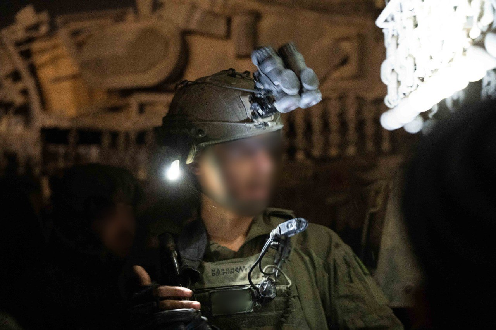

## Message 14660

דובר צה"ל:

כוחות אוגדת עזה החלו בפעילות להשמדת יעדי טרור במרחב בית חאנון

לוחמי צוות הקרב של חטיבת הנח״ל, בפיקוד אוגדת עזה (143), החלו לפעול במהלך הלילה נגד יעדי טרור במרחב בית חאנון, בעקבות מידע מודיעיני מקדים על הימצאות מחבלים ותשתיות טרור במרחב, וכחלק מהמאמץ להבטחת ביטחון תושבי העוטף. 

בטרם כניסת הכוחות, מטוסי קרב של חיל האוויר, בשילוב ירי ארטילרי, תקפו מטרות טרור רבות במרחב, בהן נקודות ריכוז מחבלים ותשתיות טרור נוספות של ארגון הטרור חמאס.

כחלק מהפעילות, כוחות צה״ל מאפשרים לאזרחים שטרם התפנו ממרחב הלחימה להתפנות למען בטחונם, דרך נתיבים מסודרים. 

צוות הקרב של חטיבת הנח״ל סיים בשבוע שעבר את משימתו במרחב רפיח לאחר שבעה חודשי לחימה, והעביר את האחריות על הגזרה לצוות הקרב של חטיבת ׳קרייתי׳ (4).

