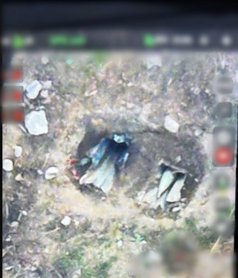

## Message 14672

דובר צה"ל:

מטוסי קרב של חיל האוויר תקפו במהלך הלילה, בהכוונת מכלול האש של חטיבת הנח"ל, את המשגרים מהם בוצע הירי לעבר המרחבים לכיש, השפלה, ירקון, מערב הנגב, יהודה וירושלים אתמול (ש׳).

במשגרים שהותקפו הייתה רקטה מוכנה לשיגור לעבר מדינת ישראל.

כתוצאה מהתקיפה זוהתה רקטה היוצאת ממתחם השיגור.

