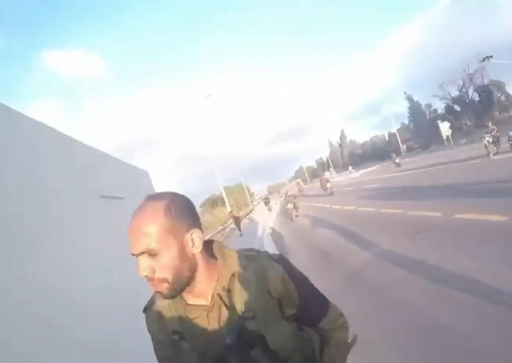

## Message 14712

הודעה משותפת לדובר צה"ל ודוברות שב"כ:

צה״ל ושב״כ חיסלו מפקד מחלקת נח׳בה של חמאס שהיה ממובילי הפשיטה לקיבוץ ניר עוז בטבח הרצחני בשבעה באוקטובר 

כלי טיס של חיל האוויר תקף וחיסל, בהובלת אוגדת עזה (143) ובהכוונת אמ״ן ושב״כ, את המחבל עבד אלהאדי צבאח, מפקד מחלקת נח׳בה בגדוד מערב חאן יונס. המחבל פעל מתוך המרחב ההומניטרי בחאן יונס. 

עבד אלהאדי צבאח היה ממובילי הפשיטה למרחב קיבוץ ניר עוז בטבח הרצחני ב-7 באוקטובר. כמו כן, במהלך המלחמה, קידם והוביל מתווי טרור רבים נגד כוחותינו. 

טרם התקיפה ננקטו צעדים רבים כדי לצמצם את הסיכוי לפגיעה באזרחים, לרבות חימוש, מידע מודיעיני ותצפיות מהאוויר. 

צה״ל ושב"כ ימשיכו לפעול בעוצמה נגד כלל המחבלים שלקחו חלק בטבח הרצחני ב-7 באוקטובר.

