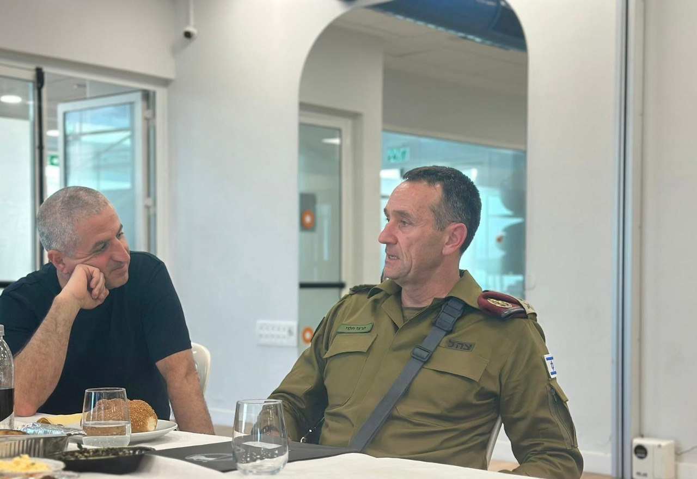

## Message 10359

דובר צה"ל:

הרמטכ״ל, רב-אלוף הרצי הלוי, ביקר היום (ו׳) בעיר נהריה בליווי ראש העיר, מר רונן מרלי. במהלך הביקור דנו בשיתוף הפעולה בין צה״ל והרשויות המקומיות בצפון, הרמטכ״ל הדגיש את מחויבות צה״ל להחזיר את תושבי הצפון לבתיהם בבטחון.
הרמטכ״ל חיזק את תושבי העיר נהריה ואת החוסן שהם מפגינים במהלך המלחמה. 

בסיור בעיר פגשו את לוחמי צה״ל הפועלים במרחב.

