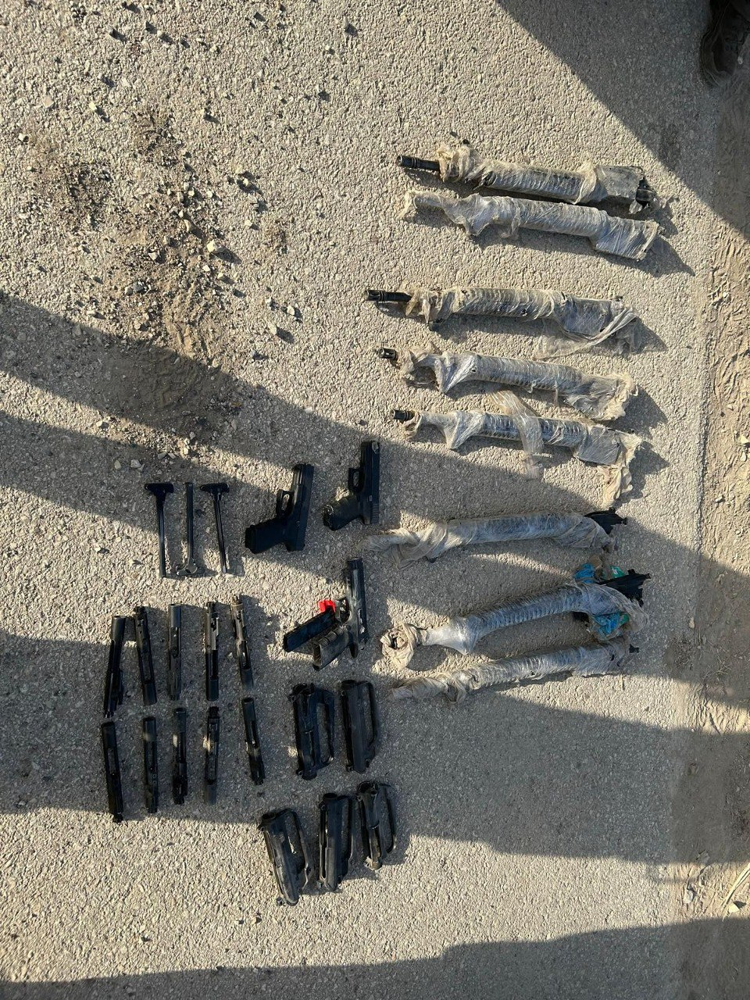

## Message 10363

דובר צה"ל:

סוכלה הברחת אמצעי לחימה במרחב חטיבת הבקעה והעמקים.

תצפיתניות מיחידה 636 זיהו הבוקר (ו׳) תנועה חשודה במרחב חטיבת הבקעה והעמקים. כוח צה״ל מגדוד 41 וכוח מיחידת יג״ל של משטרת מחוז צפון הוקפץ לנקודה, בה אותרו שלושה אקדחים, שמונה קנים, חמישה גופים של רובה מסוג M-16 ו-11 מכלולים.

כלי הנשק הועברו ליחידה המרכזית של משטרת מחוז צפון להמשך בדיקה.

