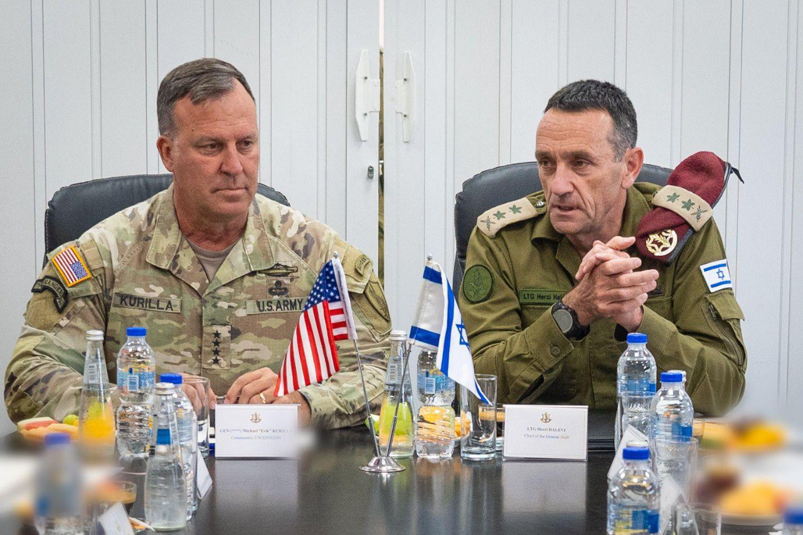

## Message 10085

דובר צה"ל:

מפקד פיקוד המרכז של צבא ארצות הברית (CENTCOM), הגנרל (****) מייקל אריק קורילה, הגיע לביקור בישראל במהלך סוף השבוע כאורחו הרשמי של הרמטכ״ל, רב-אלוף הרצי הלוי. המפקדים קיימו הערכת מצב מבצעית, דנו באתגרים אזוריים בעת האחרונה, ובחיזוק השותפות האסטרטגית באזור מול האיום האיראני ושלוחותיה של איראן באזור. 
כמו כן, דנו בהתפתחויות בגבול הצפון ובמלחמה בעזה.

