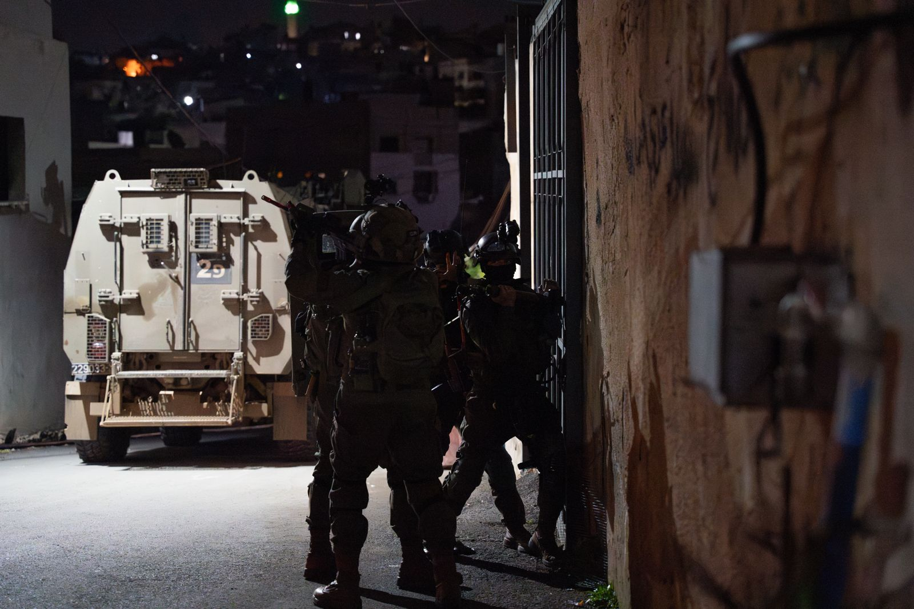

## Message 9230

דובר צה"ל:

לוחמי צה"ל, שב"כ ומג"ב עצרו הלילה חמישה מבוקשים ברחבי חטיבת עציון

הכוחות עצרו במהלך הלילה חמישה מבוקשים ברחבי חטיבת עציון.
במרחב העיר בית לחם, הכוחות החרימו אמצעי לחימה.

המבוקשים שנעצרו ואמצעי הלחימה שאותרו הועברו להמשך טיפול כוחות הביטחון, אין נפגעים לכוחותינו.

עד כה נעצרו מתחילת המלחמה כ-3,600 מבוקשים ברחבי אוגדת יהודה ושומרון ובחטיבת הבקעה והעמקים, כ-1,600 מהם משויכים לארגון הטרור חמאס.

