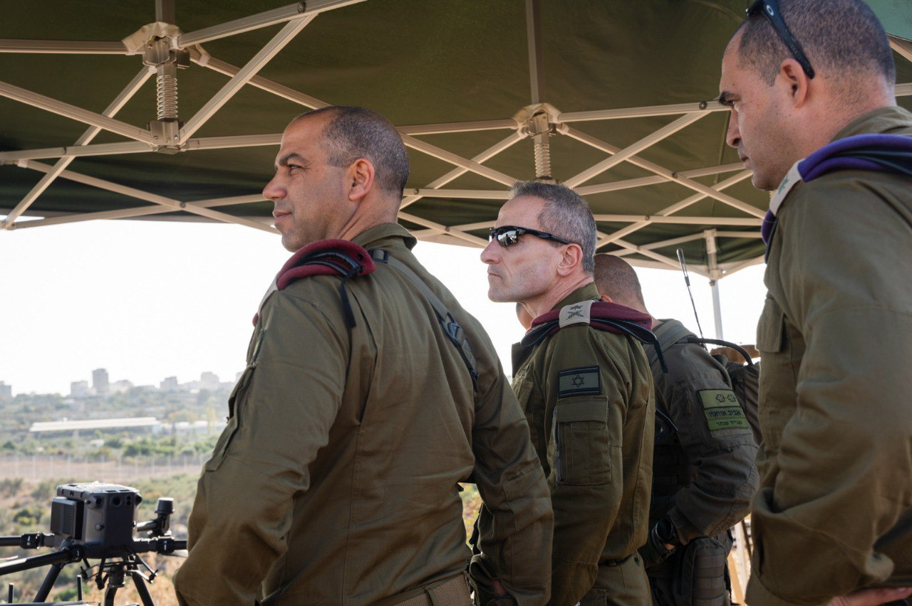

## Message 13335

דובר צה"ל:

סגן הרמטכ״ל ללוחמי צה״ל בסדיר ובמילואים באוגדת יהודה ושומרון: "אנשי המילואים שכאן פועלים מסביב לשעון ונותנים לצה״ל אורך רוח ונשימה להמשך המלחמה הזו"

סגן הרמטכ״ל, אלוף אמיר ברעם, ביקר השבוע באוגדת יהודה ושומרון וקיים הערכת מצב גזרתית עם מפקד אוגדה יהודה ושומרון, תת-אלוף יקי דולף.
האלוף סייר במרחב חטיבת "אפרים" עם לוחמי גדוד "פנתר" וקיים שיח עם מפקדי גדודי המילואים בצפון השומרון הנמצאים במשימת הגנה בגזרה.

מדבריו של סגן הרמטכ״ל, אלוף אמיר ברעם: ״צה״ל פועל בשבע זירות במקביל ומבצע תמרון קרקעי בשתיים מהן, העבודה המשמעותית והקשה שלכם מאפשרת לצה״ל לפרוס את כוחותיו בגזרות הלחימה בצפון ובדרום. 
משימתכם איננה רק לסכל טרור אלא גם לאפשר את פעילות צה״ל בשאר גזרות הלחימה ואת זה אתם עושים היטב. 
בתקופת החגים בזכות עבודתכם, יצרתם לתושבים כאן שגרת חגים טובה, הערכה רבה על כך. 
העירנות, המקצועיות והקצה המבצעי החד שלכם מונע את הפיגוע שעלול להוביל לפגיעה באזרחינו, זו עבודת קודש. 
אנשי המילואים שכאן פועלים מסביב לשעון, ונותנים לצה״ל אורך רוח ונשימה להמשך המלחמה הזו״.

