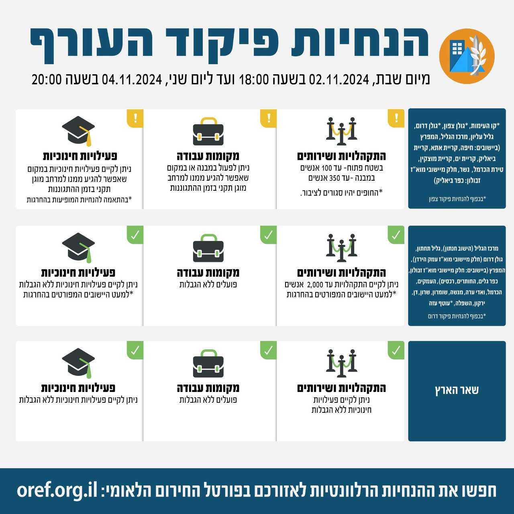

## Message 13373

דובר צה"ל:

בתום הערכת מצב, הוחלט כי הערב (ש') בשעה 18:00, יתעדכנו הנחיות ההתגוננות של פיקוד העורף. 

במסגרת השינויים אזורי הנחייה גליל תחתון וגולן דרום (בחלק מיישובי מוא״ז עמק הירדן) יעברו ממדרג פעילות חלקית למדרג פעילות מלאה עם הגבלת התקהלויות של עד 2,000 אנשים.

שאר אזורי הארץ נותרו ללא שינוי בהנחיות שניתנו עד כה.

יש להמשיך ולעקוב אחר ההנחיות המפורסמות על ידי פיקוד העורף באמצעי ההפצה הרשמיים.
ההנחיות המלאות מעודכנות בפורטל החירום הלאומי וביישומון פיקוד העורף.

