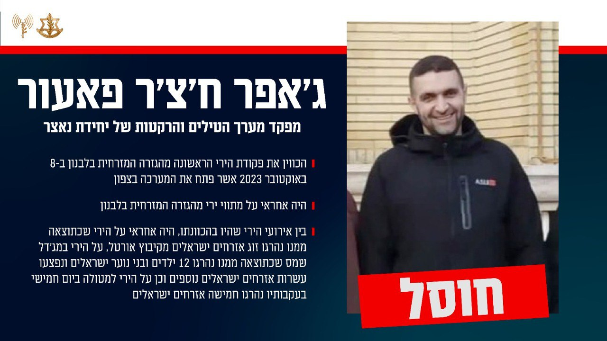

## Message 13375

דובר צה"ל:

צה"ל חיסל את מפקד מערך הטילים והרקטות של יחידת 'נאצר' בארגון הטרור חיזבאללה בדרום לבנון: עסק בקידום מתווי טרור רבים מה-8 באוקטובר נגד העורף הישראלי

מטוס קרב של חיל האוויר, בשיתוף פיקוד הצפון תקף וחיסל במרחב ג'ויא שבדרום לבנון את המחבל ג'אפר ח'צ'ר פאעור, מפקד מערך הטילים והרקטות של יחידת 'נאצר' בארגון הטרור חיזבאללה בדרום לבנון. יחד איתו חוסל גם מפקד תיק הרחפנים ביחידה. 

פאעור היה אחראי על מתווי ירי מהגזרה המזרחית בלבנון, מגזרתו יצא הירי הראשון לעבר ישראל ב-8 באוקטובר 2023, והוא שנתן את פקודת הירי לפתיחת המערכה בצפון. פאעור קידם מתווי טרור רבים לעבר העורף הישראלי וכוחות צה"ל.

פאעור היה אחראי בין היתר על ירי הרקטות שיצא מתחומי הגזרה לגולן, שכתוצאה ממנו נהרגו זוג אזרחים ישראלים מקיבוץ אורטל, על הירי על מג'דל שמס שכתוצאה ממנו נהרגו 12 ילדים ובני נוער ונפצעו עשרות אזרחים נוספים וכן על הירי למטולה ביום חמישי בעקבותיו נהרגו חמישה אזרחים.

