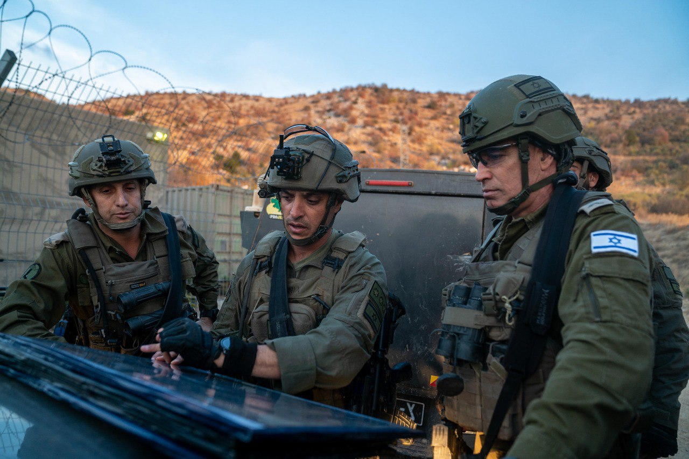

## Message 13376

דובר צה"ל:

מפקד פיקוד הצפון, אלוף אורי גורדין, ביקר היום (ש׳) בחטיבה מרחבית "ההרים" בעוצבת "הבשן" (210) עם מפקד האוגדה, תת-אלוף יאיר פלאי ומפקדים נוספים.
המפקדים סקרו בפני האלוף על תמונת המצב וההישגים המבצעיים בגזרה, ואישרו תוכניות להמשך הפעילות ההגנתית וההתקפית בקו המגע.

