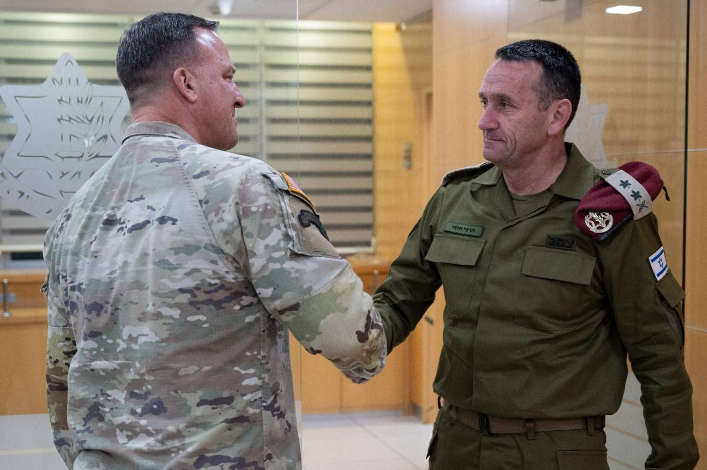

## Message 13397

דובר צה״ל: 

מפקד פיקוד המרכז בצבא ארה"ב (CENTCOM), גנרל (****) מייקל אריק קורילה נחת בסוף השבוע (ה׳) בישראל, כאורחו הרשמי של ראש המטה הכללי, רב-אלוף הרצי הלוי. 

הרמטכ״ל ומפקד סנטקום קיימו הערכת מצב בנושאים ביטחוניים-אסטרטגיים והיערכות משותפות במרחב, כחלק מהמענה לאיומים במזרח התיכון, בדגש על איראן. 

במהלך ביקורו, הגיע לסוללת ההגנה האווירית האמריקאית, ה-THAAD, שהוצבה בישראל בשבועות האחרונים למטרת חיזוק ההגנה אל מול האיומים הנשקפים.

צה"ל ימשיך להעמיק את הקשר עם צבא ארצות הברית מתוך מחויבות לחיזוק היציבות האיזורית והתיאום בין הצבאות.

