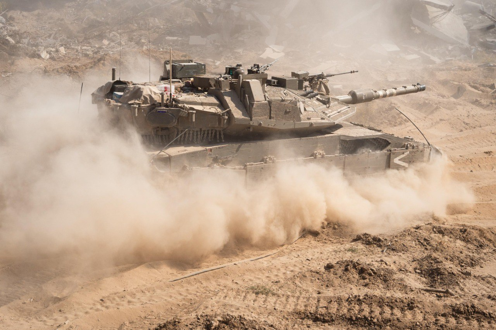

## Message 13414

דובר צה"ל:

צה"ל ממשיך בפגיעה במחבלים בלבנון וברצועת עזה: חוסל מפקד מתחם ברעשית של חיזבאללה בדרום לבנון; צה״ל ושב״כ חיסלו ברצועת עזה מחבל שהשתתף בטבח ב-7 באוקטובר

מטוסי קרב של חיל האוויר, בהכוונת אוגדה 36, תקפו וחיסלו את המחבל אבו עלי רצ'א, מפקד מתחם ברעשית של ארגון הטרור חיזבאללה, אשר הכווין והוציא לפועל מתווי ירי תמ"ס ונ"ט לעבר כוחות צה"ל ופיקד על פעילות הטרור של מחבלי חיזבאללה במרחב. 

כוחות אוגדה 91 ממשיכים לפעול בדרום לבנון, להשמיד תשתיות טרור, לאתר אמצעי לחימה רבים ולתקוף מחבלים.
ביממה האחרונה, כוחות חטיבת הנח״ל הצפונית (228) זיהו מחבל במבנה בכפר בדרום לבנון הסמוך לגבול. הכוחות תקפו את המחבל. לאחר התקיפה זוהו פיצוצי משנה.

ברצועת עזה, כלי טיס של חיל האוויר, בהכוונת מרכז האש של אוגדת עזה ושב"כ, תקף וחיסל את המחבל אחמד אל דאלו, מחבל במודיעין הצבאי של ארגון הטרור גא"פ, אשר לקח חלק בטבח ב-7 באוקטובר בכפר עזה. ביחד איתו חוסל מחבל נוסף. במהלך המלחמה היה אל דאלו מעורב בתכנון והוצאה לפועל של מתווי טרור נגד אזרחי מדינת ישראל.

