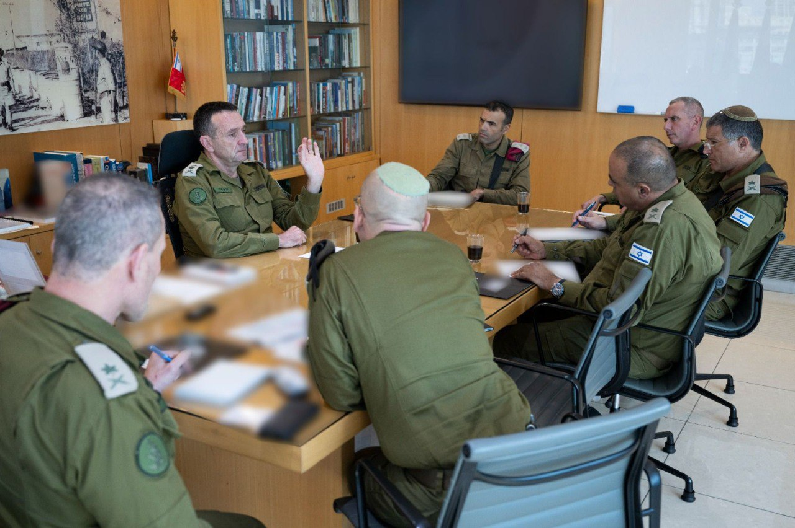

## Message 13435

דובר צה״ל:

כחלק מעבודת מטה המתקיימת בצה״ל לגיוס חרדים, היום (ב׳) הוצג לרמטכ״ל, רב-אלוף הרצי הלוי, סטטוס הקמת החטיבה החרדית, חטיבת ״חשמונאים״. עד כה, הושלמו תהליכי גיוס הסגל הפיקודי והקמת התשתיות לקליטת המתגייסים של הפלוגה הראשונה במהלך חודש דצמבר. 
בדיון השתתפו סגן הרמטכ"ל, מפקד זרוע היבשה, מפקד פיקוד ההכשרות והאימונים, רח"ט תומכ"א ואלוף-משנה אבינועם אמונה המוביל את הקמת החטיבה.

