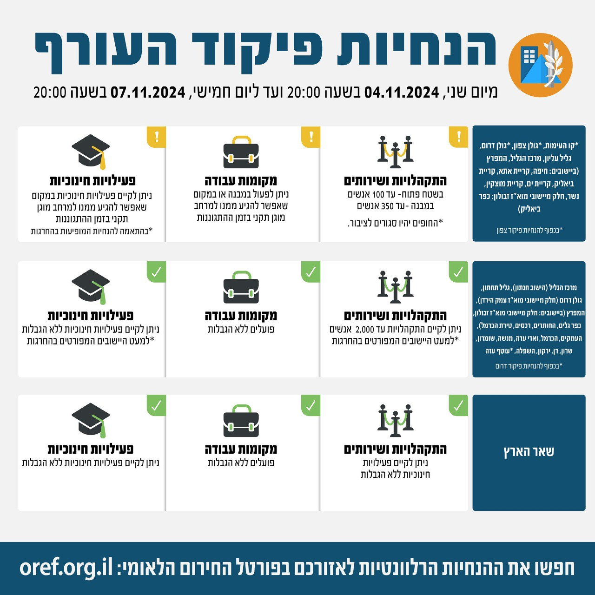

## Message 13440

דובר צה"ל:

בתום הערכת מצב, הוחלט כי הערב (ב׳) בשעה 20:00, יתעדכנו הנחיות ההתגוננות של פיקוד העורף

במסגרת השינויים- ביישוב טירת הכרמל (אזור הנחייה 'המפרץ') יעבור ממדרג פעילות חלקית למדרג פעילות מלאה.

שאר אזורי הארץ נותרו ללא שינוי בהנחיות שניתנו עד כה.

יש להמשיך ולעקוב אחר ההנחיות המפורסמות על ידי פיקוד העורף באמצעי ההפצה הרשמיים.
ההנחיות המלאות מעודכנות בפורטל החירום הלאומי וביישומון פיקוד העורף.

