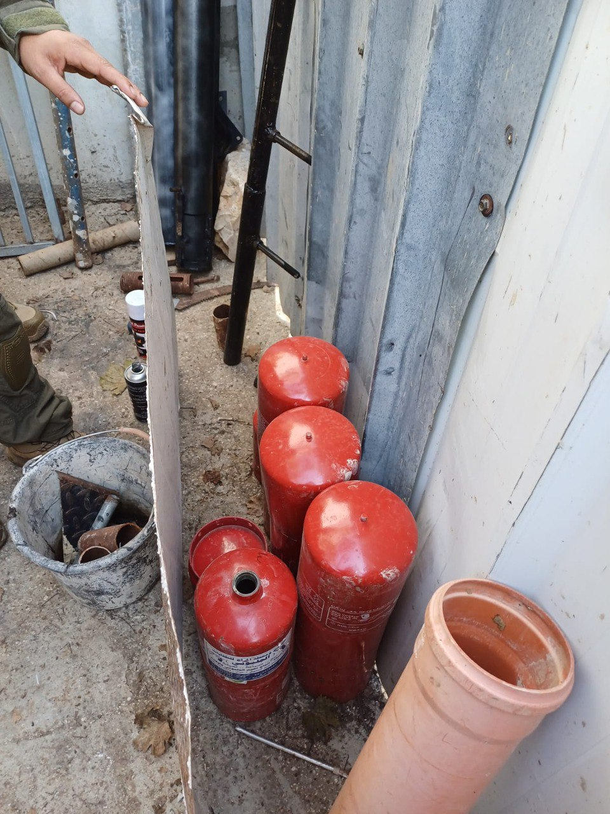

## Message 13460

דובר צה"ל:

התקלות עם מחבלים, תקיפות אוויריות ואיתור אמצעי לחימה: כוחות הביטחון פועלים בשלושה מבצעים חטיבתיים במקביל בפיקוד המרכז

כוחות צה"ל, שב"כ, מג"ב ויחידת מצדה של שב"ס החלו הלילה במבצעים חטיבתיים בחטיבות הבקעה והעמקים, במנשה ובשומרון.

במבצע בחטיבת הבקעה והעמקים הכוחות הגיעו באופן מוסק ורכוב וכיתרו את מרחבי טמון ופרעה. במהלך הפעילות הלוחמים ניהלו חילופי אש עם מחבלים ואיתרו שבעה מטענים במסגד. כלי טיס של חיל האוויר תקף וחיסל שני מחבלים חמושים, עליהם אותרו נשקים. לאחר מכן חוסל בהתקלות מחבל נוסף.

במבצע בחטיבת מנשה הותקפה חוליית מחבלים חמושים מהאוויר שירתה והשליכה מטענים לעבר הכוחות. כמו כן, אותרה מעבדת מטענים ונעצרו מספר מבוקשים. 

בחטיבת שומרון הכוחות פתחו במבצע במרחב מדמא ובורין, בעציון הוחרמו ארבעה נשקים, אותרו כספי טרור ונעצרו תשעה מבוקשים. בתפוח שביהודה ובקלקיליה שבאפרים אותרו והושמדו מטענים מאולתרים ואותרו חמישה נשקים נוספים.
אין נפגעים לכוחותינו.

בנוסף, במהלך פעילות הכוחות במרחב חטיבת הבקעה והעמקים, אותרה תשתית תת קרקעית ללא פתחי יציאה.

