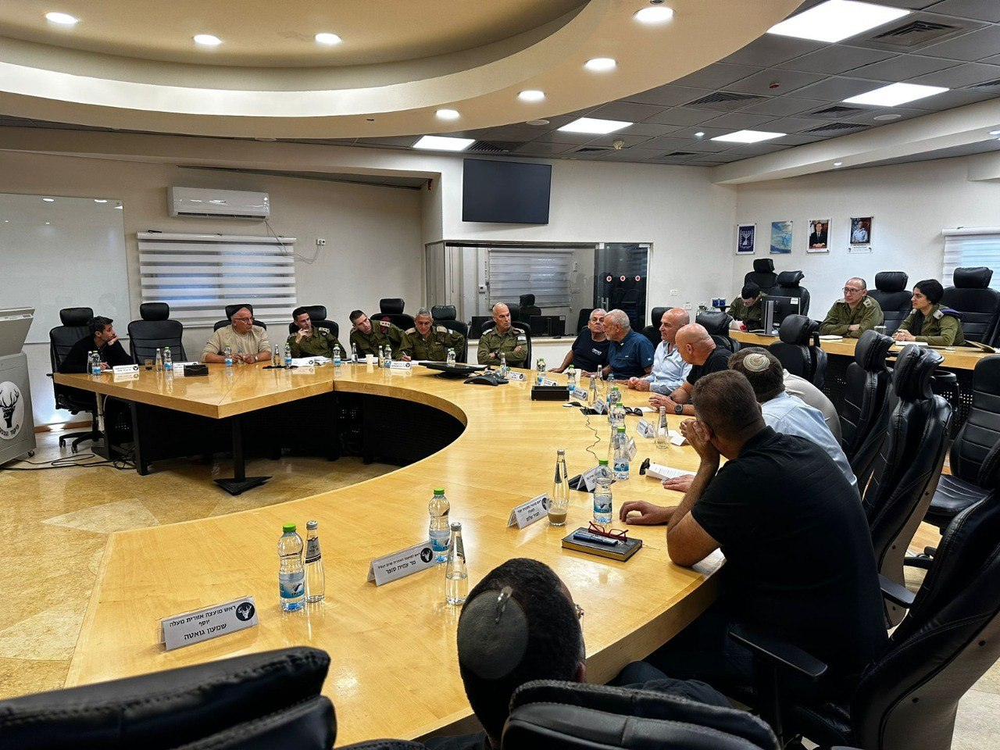

## Message 13497

דובר צה"ל:

מפקד פיקוד הצפון, אלוף אורי גורדין, נפגש הבוקר (ד׳) עם ראשי הרשויות בצפון.
האלוף סקר לראשי הרשויות אודות תמונת המצב המבצעית והפעילות הקרקעית של כוחות צה״ל בדרום לבנון. האלוף בירך והודה להם על העבודה המשותפת לאורך כל הדרך.

