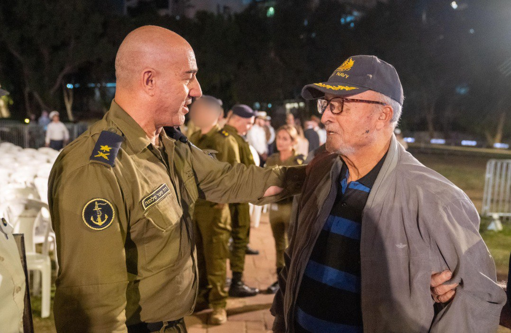

## Message 13506

טקס התייחדות עם זכר חללי חיל הים   
  
טקס ההתייחדות השנתי עם זכרם של 452 חללי זרוע הים התקיים אתמול (ג׳) באנדרטת ההנצחה לזכר חללי זרוע הים בגן "אלישבע" באשדוד. הטקס נערך בראשות מפקד זרוע הים, אלוף דוד סער סלמה ובהשתתפות המשפחות השכולות, מפקדי וחיילי הזרוע בעבר ובהווה.

