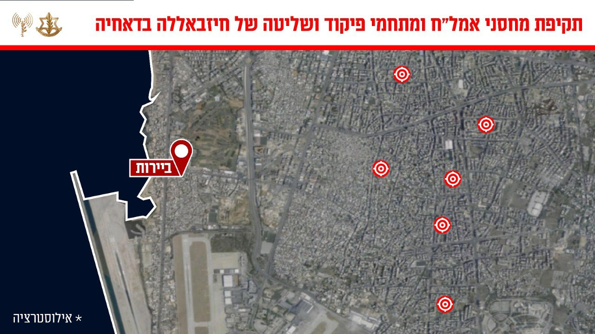

## Message 13516

דובר צה״ל:

צה״ל תקף שורת מטרות של ארגון הטרור חיזבאללה בדאחיה

לפני זמן קצר, מטוסי קרב של חיל האוויר בהכוונה מודיענית של אגף המודיעין תקפו במרחב הדאחיה בביירות מפקדות, מחסני אמצעי לחימה ותשתיות צבאיות של ארגון הטרור חיזבאללה. 

המטרות שנתקפו מוקמו על ידי חיזבאללה בלב אוכלוסייה אזרחית. זו דוגמה נוספת לניצול חיזבאללה את אזרחי לבנון כמגן אנושי. 

טרם התקיפה ננקטו צעדים רבים בכדי לצמצם את הסיכוי לפגיעה באזרחים, הכוללים שימוש בחימוש מדויק, אמצעי תצפית ואזהרות מקדימות לאוכלוסייה באזור.

