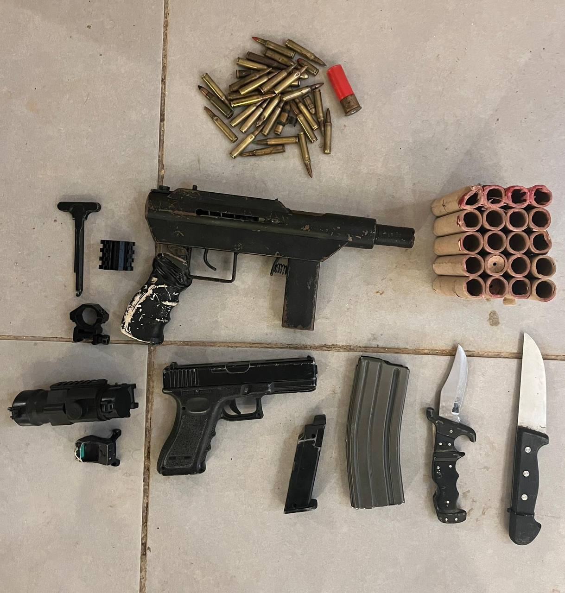

## Message 13521

דובר צה״ל: 

נשק מסוג קרלו, אמל״ח וציוד צבאי: אותרו והוחרמו אמצעי לחימה בחטיבת הבקעה והעמקים

כוחות צה״ל מגדוד הבוקע (5035) איתרו מוקדם יותר היום בעקבות מידע מודיעיני, נשק מסוג ׳קרלו׳, רחפן, אמצעי תצפית וציוד לחימה בח׳רבת נאצ׳רייה שבחטיבת הבקעה והעמקים, כמו כן נעצרו שני חשודים.  

הכוחות ממשיכים לבצע סריקות במרחב אחר חשודים נוספים. אמצעי הלחימה הוחרמו והועברו לכוחות הביטחון.

